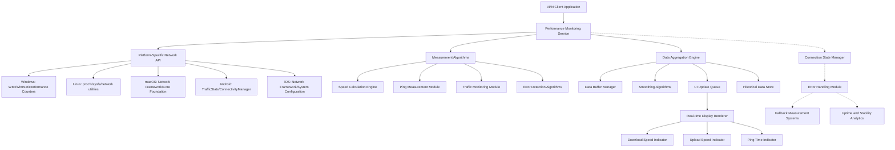

# Comprehensive Plan: VPN Client Speed and Ping Monitoring Implementation

## 1. Introduction

This document outlines the implementation plan for integrating speed indicators (download/upload speeds) and ping measurement functionality into the cross-platform VPN client. The solution will provide real-time network performance metrics while maintaining efficiency and consistency across all target platforms (Windows, Linux, macOS, Android, iOS).

## 2. Technical Approach for Measuring Network Performance While VPN is Active

### 2.1 Dual Interface Monitoring Architecture

The system will monitor both the physical and VPN interfaces simultaneously to provide accurate performance measurements:

- **Physical Interface Monitoring**: Track raw network performance to evaluate total bandwidth available
- **VPN Interface Monitoring**: Track performance specifically through the VPN tunnel
- **Comparison Engine**: Calculate overhead and actual VPN performance by comparing both interfaces

### 2.2 Active Measurement Techniques

#### 2.2.1 Speed Testing
- **Download Speed**: Download test files of known size from reliable servers
- **Upload Speed**: Upload test files of known size to reliable endpoints
- **Frequency Control**: Perform measurements at intervals to avoid overwhelming network
- **Test File Management**: Use cached test files locally to reduce dependency on external servers

#### 2.2.2 Passive Measurement Techniques
- **Traffic Monitoring**: Monitor actual data flowing through VPN interface
- **Rate Calculation**: Apply rolling averages to measure throughput over time
- **Bandwidth Estimation**: Use statistical methods to estimate capacity
- **Data Aggregation**: Combine multiple data points for accurate representation

### 2.3 Measurement Validation
- **External Verification**: Cross-check measurements with known tools
- **Calibration**: Adjust for any systematic errors
- **Range Validation**: Flag measurements that fall outside expected ranges

## 3. Real-Time Display of Download/Upload Speeds with Automatic Scaling

### 3.1 Data Collection Architecture

```
┌─────────────────┐    ┌─────────────────┐    ┌─────────────────┐
│   Network       │    │   Measurement   │    │   UI Update     │
│   Interface     │───▶│   Engine        │───▶│   Handler       │
│   Monitor       │    │   (Interval:    │    │   (Refresh:    │
│   (Real-time)   │    │   1-2 sec)      │    │   ~60fps)       │
└─────────────────┘    └─────────────────┘    └─────────────────┘
```

### 3.2 Speed Display Specifications

#### 3.2.1 Automatic Unit Scaling
- **B/s**: For speeds less than 1024 B/s
- **KB/s**: For speeds between 1024 B/s and 1024 KB/s
- **MB/s**: For speeds between 1024 KB/s and 1024 MB/s
- **GB/s**: For speeds greater than 1024 MB/s

#### 3.2.2 Decimal Precision
- Show 1-2 significant digits (e.g., 1.2 MB/s, 18.4 KB/s)
- Round appropriately to avoid unnecessary precision
- Maintain consistency with industry standards

#### 3.2.3 Visual Feedback
- **Color Coding**: 
  - Green (>10 Mbps or >10 MB/s): Excellent performance
  - Yellow (5-10 Mbps or 1-10 MB/s): Good performance
  - Orange (1-5 Mbps or 0.1-1 MB/s): Fair performance
  - Red (<1 Mbps or <0.1 MB/s): Poor performance
- **Signal Strength**: Display as visual bars or dots (●●●●○)
- **Directional Icons**: Use ↓ for download and ↑ for upload

### 3.3 Performance Optimization
- **Asynchronous Processing**: Run measurements in background threads
- **Efficient Calculations**: Use optimized algorithms to minimize CPU usage
- **Memory Management**: Implement proper garbage collection
- **Caching**: Cache calculations to avoid redundant processing

## 4. Ping Measurement and Display

### 4.1 Ping Implementation Strategy

#### 4.1.1 Target Selection
- **VPN Gateway**: Primary target for measuring VPN tunnel latency
- **Public DNS**: Configurable backup (e.g., 8.8.8.8, 1.1.1.1)
- **User Defined**: Allow custom ping targets in settings

#### 4.1.2 Method Selection
- **ICMP Ping**: Where available and permitted by OS
- **TCP Connection Time**: As fallback when ICMP is blocked
- **HTTP Request Time**: As secondary fallback for web connectivity

#### 4.1.3 Sampling and Accuracy
- **Multiple Samples**: Average 3-5 ping attempts for accuracy
- **Timeout Handling**: Set reasonable timeout limits (e.g., 3 seconds)
- **Jitter Calculation**: Report variation between ping samples

### 4.2 Ping Display Format
- **Units**: Display in milliseconds (ms) with whole numbers
- **Decimal Places**: Show tenths of ms when < 10ms for precision
- **Status Indicators**: Color-coded based on threshold:
  - Green (< 50ms): Excellent latency
  - Yellow (50-100ms): Good latency  
  - Orange (100-200ms): Fair latency
  - Red (> 200ms): Poor latency
- **Unavailable**: Show "--" during disconnection or measurement failure

## 5. UI Integration with Existing Mockups

### 5.1 Central Status Card Enhancement

The performance metrics will be integrated into the existing central status card:

```
┌─────────────────────────────────────────────────────────────┐
│                        [VPN STATUS CARD]                    │
│  ┌─────────────────────────────────────────────────────────┐│
│  │                    [SHIELD ICON]                        ││
│  │                   CONNECTION STATUS                     ││
│  │                 (Location: Tokyo, Japan)                ││
│  │                                                         ││
│  │                   ↓ Download: 18.2 MB/s  [●●●●○]       ││
│  │                   ↑ Upload: 12.4 MB/s    [●●●●○]       ││
│  │                   ⚡ Ping: 24 ms           [●●●●●]       ││
│  └─────────────────────────────────────────────────────────┘│
└─────────────────────────────────────────────────────────────┘
```

### 5.2 Dynamic State Management

#### 5.2.1 Connected State
- Display all performance metrics with real-time updates
- Show location and server information
- Use green color scheme for positive connection state

#### 5.2.2 Connecting State
- Show connecting status with spinner animation
- Display "Measuring..." for metrics that aren't available yet
- Use amber/yellow color scheme for connecting state

#### 5.2.3 Disconnected State
- Gray out metrics and show "--" for unavailable values
- Display disconnected status with neutral colors
- Show option to reconnect via primary button

#### 5.2.4 Error State
- Show error indicators with red color scheme
- Display error message and possible solutions
- Provide diagnostics and troubleshooting options

## 6. Platform-Specific Implementation Approaches

### 6.1 Windows Implementation
- **Framework**: .NET MAUI for cross-platform compatibility
- **Network Access**: Use Windows.Networking.Connectivity namespace
- **Performance Counters**: Leverage Performance Counters for detailed metrics
- **Permissions**: Standard user privileges sufficient for monitoring
- **API**: WinINet, WMI, or Network Interface classes

### 6.2 Linux Implementation
- **Framework**: Electron or native Qt/C++ implementation
- **Network Monitoring**: Access `/proc/net/dev`, `/sys/class/net/`
- **Privilege Handling**: Standard user permissions for interface statistics
- **Tools Integration**: System command execution for ping utility
- **Package Management**: Use distro-appropriate packaging formats

### 6.3 macOS Implementation
- **Framework**: SwiftUI for modern UI or AppKit for traditional approach
- **Network Framework**: Use Apple's Network Framework for monitoring
- **Sandboxing**: Handle macOS security restrictions appropriately
- **Core Foundation**: Use Core Foundation for low-level network access
- **App Store Compliance**: Ensure adherence to App Store guidelines

### 6.4 Android Implementation
- **Framework**: Kotlin/Java with Android SDK
- **Permissions**: INTERNET, ACCESS_NETWORK_STATE, FOREGROUND_SERVICE
- **Network Monitoring**: Use TrafficStats, ConnectivityManager, NetworkStatsManager
- **Battery Optimization**: Respect Doze mode and App Standby
- **Background Services**: Use Foreground Services for continuous monitoring

### 6.5 iOS Implementation
- **Framework**: Swift with UIKit or SwiftUI
- **Background Processing**: Implement appropriate background modes
- **Network Extensions**: Use Network Framework for efficient monitoring
- **App Store Guidelines**: Ensure compliance with privacy and network monitoring policies
- **Privacy Model**: Respect iOS privacy and security model

## 7. Performance Optimization Strategies

### 7.1 Resource Efficiency
- **Smart Sampling**: Increase measurement frequency during active use, decrease during idle
- **Batch Processing**: Group operations to minimize system calls
- **Cache Results**: Store recent measurements to avoid redundant calculations
- **Adaptive Frequency**: Adjust measurement intervals based on stability

### 7.2 Network Impact Minimization
- **Minimal Test Traffic**: Use small test files to minimize data consumption
- **Compression**: Compress test data when possible
- **Local Testing**: Prioritize local or nearby test endpoints
- **Efficient Protocols**: Use lightweight protocols for measurement

### 7.3 Battery Life Preservation
- **Power-Aware Algorithms**: Reduce activity when on battery power
- **Background Limits**: Respect platform-specific background processing limits
- **Adaptive Scheduling**: Adjust measurement schedule based on device state
- **Low Power Mode**: Implement platform-specific power saving modes

## 8. Data Refresh Rates and UI Update Strategy

### 8.1 Measurement Schedule

#### 8.1.1 Active Connection (During Traffic)
- **Speed Measurement**: Every 2 seconds
- **Ping Measurement**: Every 3 seconds
- **Interface Stats**: Every 1 second
- **Aggregation Window**: 5-second rolling average

#### 8.1.2 Idle Connection
- **Speed Measurement**: Every 10 seconds
- **Ping Measurement**: Every 5 seconds
- **Interface Stats**: Every 2 seconds
- **Aggregation Window**: 30-second rolling average

#### 8.1.3 Connection Establishment
- **Speed Measurement**: Every 2 seconds (for first 30 seconds)
- **Ping Measurement**: Every 1 second (for first 30 seconds)
- **Continuous Monitoring**: Until stable connection achieved

### 8.2 UI Update Strategy
- **Smooth Transitions**: Animate value changes for better UX
- **Frame Rate**: 60fps for visual updates
- **Interpolation**: Estimate intermediate values between measurements
- **State Consistency**: Update all metrics simultaneously to avoid inconsistent UI states

## 9. Edge Case Handling

### 9.1 Connection Drops
- **Rapid Detection**: Monitor for sudden drops in activity
- **Graceful Notification**: Display clear disconnection status
- **Reconnection Monitoring**: Automatically resume measurements when possible
- **Session History**: Preserve recent metrics for post-disconnection analysis

### 9.2 Unstable Connections
- **Adaptive Strategy**: Increase ping frequency during instability
- **Hysteresis**: Prevent rapid state changes due to brief fluctuations
- **User Alerts**: Notify of connection quality issues
- **Fallback Options**: Use alternative measurement methods

### 9.3 Measurement Failures
- **Progressive Fallback**: Try alternate measurement methods
- **Graceful Degradation**: Provide partial metrics when full measurements fail
- **Error Recovery**: Automatically retry failed measurements
- **User Transparency**: Clearly indicate metric uncertainty

### 9.4 Network Restrictions
- **Firewall Handling**: Detect and adapt to network restrictions
- **Proxy Support**: Account for proxy servers in measurements
- **Corporate Networks**: Adapt to enterprise network policies
- **Carrier Restrictions**: Handle mobile carrier limitations

## 10. Implementation Architecture



## 11. Implementation Timeline

### Phase 1: Foundation and Core Components (Week 1-2)
- **Deliverable 1.1**: Base architecture and measurement service skeleton
- **Deliverable 1.2**: Unit testing framework setup

### Phase 2: Platform-Specific Implementations (Week 3-4)  
- **Deliverable 2.1**: Desktop platform implementations (Windows, macOS, Linux)
- **Deliverable 2.2**: Mobile platform implementations (Android, iOS)

### Phase 3: UI Integration (Week 5)
- **Deliverable 3.1**: Real-time metric display components

### Phase 4: Advanced Features and Optimization (Week 6)
- **Deliverable 4.1**: Performance optimization implementation
- **Deliverable 4.2**: Edge case handling

### Phase 5: Testing and Quality Assurance (Week 7)
- **Deliverable 5.1**: Cross-platform consistency testing

## 12. Quality Assurance Strategy

### 12.1 Testing Approach
- **Unit Testing**: Verify individual components and algorithms
- **Integration Testing**: Test component interactions
- **Cross-Platform Testing**: Validate consistency across platforms
- **Performance Testing**: Ensure minimal resource impact
- **Real-World Testing**: Test with various network conditions

### 12.2 Validation Criteria
- **Accuracy**: Measurements within 5% of external tools
- **Performance**: Less than 2% CPU utilization during normal operation
- **Responsiveness**: UI updates within 300ms of measurement
- **Consistency**: Identical behavior across all platforms

## 13. Conclusion

This comprehensive plan provides a robust foundation for implementing speed and ping measurement functionality in the VPN client. The architecture prioritizes accuracy, efficiency, and user experience while maintaining consistency across all target platforms. The phased implementation approach ensures manageable development cycles with clear deliverables and quality assurance checkpoints.
## 1. Introduction

This document outlines the implementation plan for integrating speed indicators (download/upload speeds) and ping measurement functionality into the cross-platform VPN client. The solution will provide real-time network performance metrics while maintaining efficiency and consistency across all target platforms (Windows, Linux, macOS, Android, iOS).

## 2. Technical Approach for Measuring Network Performance While VPN is Active

### 2.1 Dual Interface Monitoring Architecture

The system will monitor both the physical and VPN interfaces simultaneously to provide accurate performance measurements:

- **Physical Interface Monitoring**: Track raw network performance to evaluate total bandwidth available
- **VPN Interface Monitoring**: Track performance specifically through the VPN tunnel
- **Comparison Engine**: Calculate overhead and actual VPN performance by comparing both interfaces

### 2.2 Active Measurement Techniques

#### 2.2.1 Speed Testing
- **Download Speed**: Download test files of known size from reliable servers
- **Upload Speed**: Upload test files of known size to reliable endpoints
- **Frequency Control**: Perform measurements at intervals to avoid overwhelming network
- **Test File Management**: Use cached test files locally to reduce dependency on external servers

#### 2.2.2 Passive Measurement Techniques
- **Traffic Monitoring**: Monitor actual data flowing through VPN interface
- **Rate Calculation**: Apply rolling averages to measure throughput over time
- **Bandwidth Estimation**: Use statistical methods to estimate capacity
- **Data Aggregation**: Combine multiple data points for accurate representation

### 2.3 Measurement Validation
- **External Verification**: Cross-check measurements with known tools
- **Calibration**: Adjust for any systematic errors
- **Range Validation**: Flag measurements that fall outside expected ranges

## 3. Real-Time Display of Download/Upload Speeds with Automatic Scaling

### 3.1 Data Collection Architecture

```
┌─────────────────┐    ┌─────────────────┐    ┌─────────────────┐
│   Network       │    │   Measurement   │    │   UI Update     │
│   Interface     │───▶│   Engine        │───▶│   Handler       │
│   Monitor       │    │   (Interval:    │    │   (Refresh:    │
│   (Real-time)   │    │   1-2 sec)      │    │   ~60fps)       │
└─────────────────┘    └─────────────────┘    └─────────────────┘
```

### 3.2 Speed Display Specifications

#### 3.2.1 Automatic Unit Scaling
- **B/s**: For speeds less than 1024 B/s
- **KB/s**: For speeds between 1024 B/s and 1024 KB/s
- **MB/s**: For speeds between 1024 KB/s and 1024 MB/s
- **GB/s**: For speeds greater than 1024 MB/s

#### 3.2.2 Decimal Precision
- Show 1-2 significant digits (e.g., 1.2 MB/s, 18.4 KB/s)
- Round appropriately to avoid unnecessary precision
- Maintain consistency with industry standards

#### 3.2.3 Visual Feedback
- **Color Coding**: 
  - Green (>10 Mbps or >10 MB/s): Excellent performance
  - Yellow (5-10 Mbps or 1-10 MB/s): Good performance
  - Orange (1-5 Mbps or 0.1-1 MB/s): Fair performance
  - Red (<1 Mbps or <0.1 MB/s): Poor performance
- **Signal Strength**: Display as visual bars or dots (●●●●○)
- **Directional Icons**: Use ↓ for download and ↑ for upload

### 3.3 Performance Optimization
- **Asynchronous Processing**: Run measurements in background threads
- **Efficient Calculations**: Use optimized algorithms to minimize CPU usage
- **Memory Management**: Implement proper garbage collection
- **Caching**: Cache calculations to avoid redundant processing

## 4. Ping Measurement and Display

### 4.1 Ping Implementation Strategy

#### 4.1.1 Target Selection
- **VPN Gateway**: Primary target for measuring VPN tunnel latency
- **Public DNS**: Configurable backup (e.g., 8.8.8.8, 1.1.1.1)
- **User Defined**: Allow custom ping targets in settings

#### 4.1.2 Method Selection
- **ICMP Ping**: Where available and permitted by OS
- **TCP Connection Time**: As fallback when ICMP is blocked
- **HTTP Request Time**: As secondary fallback for web connectivity

#### 4.1.3 Sampling and Accuracy
- **Multiple Samples**: Average 3-5 ping attempts for accuracy
- **Timeout Handling**: Set reasonable timeout limits (e.g., 3 seconds)
- **Jitter Calculation**: Report variation between ping samples

### 4.2 Ping Display Format
- **Units**: Display in milliseconds (ms) with whole numbers
- **Decimal Places**: Show tenths of ms when < 10ms for precision
- **Status Indicators**: Color-coded based on threshold:
  - Green (< 50ms): Excellent latency
  - Yellow (50-100ms): Good latency  
  - Orange (100-200ms): Fair latency
  - Red (> 200ms): Poor latency
- **Unavailable**: Show "--" during disconnection or measurement failure

## 5. UI Integration with Existing Mockups

### 5.1 Central Status Card Enhancement

The performance metrics will be integrated into the existing central status card:

```
┌─────────────────────────────────────────────────────────────┐
│                        [VPN STATUS CARD]                    │
│  ┌─────────────────────────────────────────────────────────┐│
│  │                    [SHIELD ICON]                        ││
│  │                   CONNECTION STATUS                     ││
│  │                 (Location: Tokyo, Japan)                ││
│  │                                                         ││
│  │                   ↓ Download: 18.2 MB/s  [●●●●○]       ││
│  │                   ↑ Upload: 12.4 MB/s    [●●●●○]       ││
│  │                   ⚡ Ping: 24 ms           [●●●●●]       ││
│  └─────────────────────────────────────────────────────────┘│
└─────────────────────────────────────────────────────────────┘
```

### 5.2 Dynamic State Management

#### 5.2.1 Connected State
- Display all performance metrics with real-time updates
- Show location and server information
- Use green color scheme for positive connection state

#### 5.2.2 Connecting State
- Show connecting status with spinner animation
- Display "Measuring..." for metrics that aren't available yet
- Use amber/yellow color scheme for connecting state

#### 5.2.3 Disconnected State
- Gray out metrics and show "--" for unavailable values
- Display disconnected status with neutral colors
- Show option to reconnect via primary button

#### 5.2.4 Error State
- Show error indicators with red color scheme
- Display error message and possible solutions
- Provide diagnostics and troubleshooting options

## 6. Platform-Specific Implementation Approaches

### 6.1 Windows Implementation
- **Framework**: .NET MAUI for cross-platform compatibility
- **Network Access**: Use Windows.Networking.Connectivity namespace
- **Performance Counters**: Leverage Performance Counters for detailed metrics
- **Permissions**: Standard user privileges sufficient for monitoring
- **API**: WinINet, WMI, or Network Interface classes

### 6.2 Linux Implementation
- **Framework**: Electron or native Qt/C++ implementation
- **Network Monitoring**: Access `/proc/net/dev`, `/sys/class/net/`
- **Privilege Handling**: Standard user permissions for interface statistics
- **Tools Integration**: System command execution for ping utility
- **Package Management**: Use distro-appropriate packaging formats

### 6.3 macOS Implementation
- **Framework**: SwiftUI for modern UI or AppKit for traditional approach
- **Network Framework**: Use Apple's Network Framework for monitoring
- **Sandboxing**: Handle macOS security restrictions appropriately
- **Core Foundation**: Use Core Foundation for low-level network access
- **App Store Compliance**: Ensure adherence to App Store guidelines

### 6.4 Android Implementation
- **Framework**: Kotlin/Java with Android SDK
- **Permissions**: INTERNET, ACCESS_NETWORK_STATE, FOREGROUND_SERVICE
- **Network Monitoring**: Use TrafficStats, ConnectivityManager, NetworkStatsManager
- **Battery Optimization**: Respect Doze mode and App Standby
- **Background Services**: Use Foreground Services for continuous monitoring

### 6.5 iOS Implementation
- **Framework**: Swift with UIKit or SwiftUI
- **Background Processing**: Implement appropriate background modes
- **Network Extensions**: Use Network Framework for efficient monitoring
- **App Store Guidelines**: Ensure compliance with privacy and network monitoring policies
- **Privacy Model**: Respect iOS privacy and security model

## 7. Performance Optimization Strategies

### 7.1 Resource Efficiency
- **Smart Sampling**: Increase measurement frequency during active use, decrease during idle
- **Batch Processing**: Group operations to minimize system calls
- **Cache Results**: Store recent measurements to avoid redundant calculations
- **Adaptive Frequency**: Adjust measurement intervals based on stability

### 7.2 Network Impact Minimization
- **Minimal Test Traffic**: Use small test files to minimize data consumption
- **Compression**: Compress test data when possible
- **Local Testing**: Prioritize local or nearby test endpoints
- **Efficient Protocols**: Use lightweight protocols for measurement

### 7.3 Battery Life Preservation
- **Power-Aware Algorithms**: Reduce activity when on battery power
- **Background Limits**: Respect platform-specific background processing limits
- **Adaptive Scheduling**: Adjust measurement schedule based on device state
- **Low Power Mode**: Implement platform-specific power saving modes

## 8. Data Refresh Rates and UI Update Strategy

### 8.1 Measurement Schedule

#### 8.1.1 Active Connection (During Traffic)
- **Speed Measurement**: Every 2 seconds
- **Ping Measurement**: Every 3 seconds
- **Interface Stats**: Every 1 second
- **Aggregation Window**: 5-second rolling average

#### 8.1.2 Idle Connection
- **Speed Measurement**: Every 10 seconds
- **Ping Measurement**: Every 5 seconds
- **Interface Stats**: Every 2 seconds
- **Aggregation Window**: 30-second rolling average

#### 8.1.3 Connection Establishment
- **Speed Measurement**: Every 2 seconds (for first 30 seconds)
- **Ping Measurement**: Every 1 second (for first 30 seconds)
- **Continuous Monitoring**: Until stable connection achieved

### 8.2 UI Update Strategy
- **Smooth Transitions**: Animate value changes for better UX
- **Frame Rate**: 60fps for visual updates
- **Interpolation**: Estimate intermediate values between measurements
- **State Consistency**: Update all metrics simultaneously to avoid inconsistent UI states

## 9. Edge Case Handling

### 9.1 Connection Drops
- **Rapid Detection**: Monitor for sudden drops in activity
- **Graceful Notification**: Display clear disconnection status
- **Reconnection Monitoring**: Automatically resume measurements when possible
- **Session History**: Preserve recent metrics for post-disconnection analysis

### 9.2 Unstable Connections
- **Adaptive Strategy**: Increase ping frequency during instability
- **Hysteresis**: Prevent rapid state changes due to brief fluctuations
- **User Alerts**: Notify of connection quality issues
- **Fallback Options**: Use alternative measurement methods

### 9.3 Measurement Failures
- **Progressive Fallback**: Try alternate measurement methods
- **Graceful Degradation**: Provide partial metrics when full measurements fail
- **Error Recovery**: Automatically retry failed measurements
- **User Transparency**: Clearly indicate metric uncertainty

### 9.4 Network Restrictions
- **Firewall Handling**: Detect and adapt to network restrictions
- **Proxy Support**: Account for proxy servers in measurements
- **Corporate Networks**: Adapt to enterprise network policies
- **Carrier Restrictions**: Handle mobile carrier limitations

## 10. Implementation Architecture


## 11. Implementation Timeline

### Phase 1: Foundation and Core Components (Week 1-2)
- **Deliverable 1.1**: Base architecture and measurement service skeleton
- **Deliverable 1.2**: Unit testing framework setup

### Phase 2: Platform-Specific Implementations (Week 3-4)  
- **Deliverable 2.1**: Desktop platform implementations (Windows, macOS, Linux)
- **Deliverable 2.2**: Mobile platform implementations (Android, iOS)

### Phase 3: UI Integration (Week 5)
- **Deliverable 3.1**: Real-time metric display components

### Phase 4: Advanced Features and Optimization (Week 6)
- **Deliverable 4.1**: Performance optimization implementation
- **Deliverable 4.2**: Edge case handling

### Phase 5: Testing and Quality Assurance (Week 7)
- **Deliverable 5.1**: Cross-platform consistency testing

## 12. Quality Assurance Strategy

### 12.1 Testing Approach
- **Unit Testing**: Verify individual components and algorithms
- **Integration Testing**: Test component interactions
- **Cross-Platform Testing**: Validate consistency across platforms
- **Performance Testing**: Ensure minimal resource impact
- **Real-World Testing**: Test with various network conditions

### 12.2 Validation Criteria
- **Accuracy**: Measurements within 5% of external tools
- **Performance**: Less than 2% CPU utilization during normal operation
- **Responsiveness**: UI updates within 300ms of measurement
- **Consistency**: Identical behavior across all platforms

## 13. Conclusion

This comprehensive plan provides a robust foundation for implementing speed and ping measurement functionality in the VPN client. The architecture prioritizes accuracy, efficiency, and user experience while maintaining consistency across all target platforms. The phased implementation approach ensures manageable development cycles with clear deliverables and quality assurance checkpoints.
