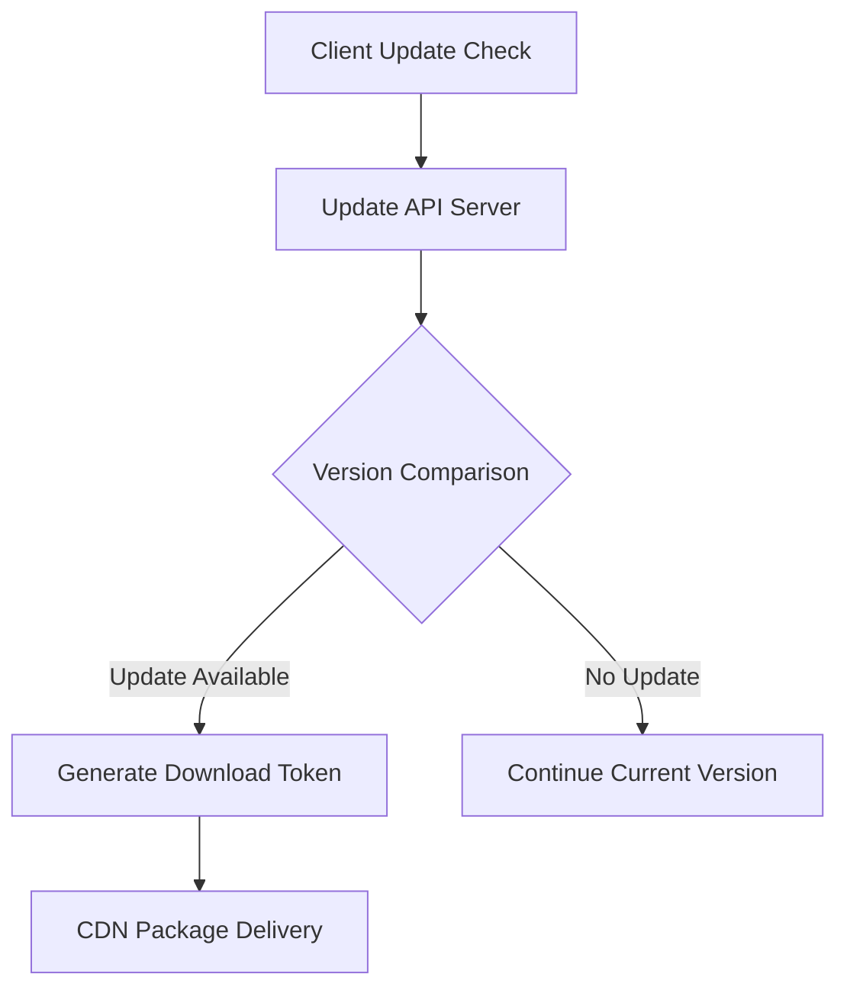

# Server Hosting Setup Plan for VPN Client Installation Packages

## Overview

This document outlines the comprehensive plan for setting up a secure server infrastructure to host and distribute VPN client installation packages. The plan ensures that the installation packages are securely hosted with appropriate access controls and monitoring systems.

## 1. Server Infrastructure Requirements

### 1.1 Hardware Specifications
- **CPU**: Minimum 4-core processor (8-16 cores recommended for high availability)
- **RAM**: Minimum 8GB RAM (32GB+ for high-traffic scenarios)
- **Storage**: SSD storage with minimum 500GB for installation packages
- **Network**: High-speed internet connection (1Gbps+ recommended)
- **Redundancy**: Multiple servers across different availability zones

### 1.2 Operating System & Software Stack
- **OS**: Ubuntu Server 22.04 LTS or CentOS Stream 9 for stability
- **Web Server**: Nginx or Apache HTTP Server as reverse proxy
- **Application Server**: Node.js, Python Flask/FastAPI, or Go-based server
- **Database**: PostgreSQL or MySQL for user management and download tracking
- **Object Storage**: MinIO or AWS S3-compatible storage for package files
- **Cache Layer**: Redis for session management and rate limiting

### 1.3 Network Configuration
- **Firewall**: UFW or iptables configured with minimal required ports
- **Load Balancer**: HAProxy or NGINX Plus for traffic distribution
- **DDoS Protection**: Cloudflare or similar service integration
- **Port Configuration**: HTTPS (443), SSH (22) with key auth only

## 2. Security Measures for Access Restriction

### 2.1 Authentication Systems
- **JWT Tokens**: JSON Web Tokens with refresh token rotation
- **OAuth 2.0**: Integration with identity providers (Google, Microsoft, etc.)
- **Multi-Factor Authentication (MFA)**: TOTP-based MFA for admin access
- **API Key Management**: Per-application API keys for automated access

### 2.2 Authorization Framework
- **Role-Based Access Control (RBAC)**: Admin, User, Guest roles
- **Permission System**: Granular permissions for different package types
- **JWT Claims**: Embedded claims for user role validation
- **Entitlement Checks**: Verify user subscription/license status

### 2.3 Security Headers & Protocols
- **HTTPS Enforcement**: Redirect all HTTP traffic to HTTPS
- **HSTS**: HTTP Strict Transport Security headers
- **CSP**: Content Security Policy headers
- **Rate Limiting**: Per-IP and per-user rate limiting
- **CSRF Protection**: Cross-site request forgery prevention
- **SQL Injection Prevention**: Parameterized queries and input validation

## 3. Bandwidth and Storage Considerations

### 3.1 Storage Requirements
- **Package Storage**: Calculate based on package size × expected downloads
- **Metadata Storage**: Database space for user records and analytics
- **Log Storage**: Disk space for audit logs (typically 10% of package size)
- **Backup Storage**: Additional 100% storage for backup redundancy
- **Buffer Space**: 25% buffer for temporary file processing

### 3.2 Bandwidth Estimation
- **Package Size**: Average ~50MB per installation package
- **Monthly Downloads**: Estimated 10,000 downloads/month
- **Peak Traffic**: 3x average during new release periods
- **Bandwidth Buffer**: Additional 50% for CDN and API traffic
- **Total Monthly**: ~5TB for packages + 1TB for CDN/management traffic

### 3.3 Cost Optimization
- **Compressed Packages**: Reduce package size with compression
- **Differential Updates**: Delta packages to minimize download size
- **Smart Caching**: Edge caching for frequently accessed packages
- **Off-Peak Processing**: Batch operations during low-traffic periods

## 4. CDN Setup for Global Distribution

### 4.1 CDN Selection Criteria
- **Geographic Coverage**: Points of presence in target regions
- **Security Features**: DDoS protection, WAF integration
- **Performance**: Low latency and high throughput
- **Cost**: Competitive pricing for traffic volumes
- **Customization**: Ability to implement authentication headers

### 4.2 CDN Architecture
- **Primary CDN**: CloudFlare Enterprise or AWS CloudFront
- **Fallback CDN**: Secondary provider for failover capability
- **Edge Authentication**: Validate tokens at CDN edge nodes
- **Regional Caching**: Geographic optimization for faster downloads
- **Package Tagging**: TTL configuration by package type/version

### 4.3 CDN Integration Pattern
```
Client Request -> CDN Edge Server -> Validate Token -> Origin Server
```

### 4.4 CDN Security Implementation
- **Origin Shield**: Protect origin server from direct access
- **Signed URLs**: Time-limited URLs for private package access
- **IP Allow Lists**: Restrict origin access to CDN IP ranges
- **WAF Integration**: Web Application Firewall at CDN layer

## 5. Download Tracking and Analytics

### 5.1 Data Collection Points
- **Download Initiation**: Timestamp, user ID, package ID
- **Download Completion**: Success/failure, duration, bytes transferred
- **Client Information**: OS, device type, client version
- **Geographic Data**: IP-based location mapping
- **Referrer Information**: App update vs direct download

### 5.2 Analytics Infrastructure
- **Event Logging**: Centralized logging with ELK stack or similar
- **Real-time Stats**: Metrics collection with Prometheus/Grafana
- **Usage Dashboard**: Visual analytics for business intelligence
- **Anomaly Detection**: Alerting for unusual traffic patterns
- **Conversion Tracking**: Link downloads to user engagement

### 5.3 Privacy Compliance
- **GDPR Compliance**: Anonymize personal data where possible
- **Data Retention**: Configurable retention policies
- **Opt-out Mechanisms**: User preference controls
- **Audit Logs**: Maintain access logs for compliance
- **Data Transfer**: Secure transmission of analytics data

## 6. Access Control Mechanisms

### 6.1 Token-Based Access System
```
User Authenticates -> JWT Generation -> Package Authorization Check -> Access Token Creation -> Download Permission
```

### 6.2 Conditional Access Rules
- **License Verification**: Verify active subscription status
- **Geographic Restrictions**: Block access from restricted jurisdictions
- **Device Limits**: Limit concurrent active devices per account
- **Package Eligibility**: Verify user can access specific package types
- **Time Windows**: Temporary access tokens for limited duration

### 6.3 Session Management
- **Concurrent Sessions**: Limit simultaneous downloads per user
- **Session Timeout**: Automatic logout after inactivity
- **Token Refresh**: Secure refresh token rotation
- **Logout Propagation**: Invalidate sessions across all systems

### 6.4 Package Classification
- **Public Packages**: Minimal access restrictions (beta versions)
- **Licensed Packages**: Subscription-based access control
- **Enterprise Packages**: Account-specific distribution
- **Development Packages**: Role-based access for internal teams

## 7. Backup and Redundancy Strategies

### 7.1 Data Backup Solutions
- **Package Replication**: Multi-region replication for installation packages
- **Database Backups**: Encrypted daily backups with point-in-time recovery
- **Configuration Backups**: Version-controlled infrastructure as code
- **Snapshot Schedule**: Daily snapshots of running systems
- **Off-site Storage**: Cold storage for long-term retention

### 7.2 Disaster Recovery Plan
- **Recovery Time Objective (RTO)**: 1 hour for critical systems
- **Recovery Point Objective (RPO)**: 15 minutes for transactional data
- **Failover Process**: Automated detection and switchover
- **Testing Schedule**: Quarterly disaster recovery exercises
- **Documentation**: Step-by-step recovery procedures

### 7.3 High Availability Architecture
- **Multiple AZs**: Deployment across availability zones
- **Auto-scaling**: Scale resources based on demand
- **Health Checks**: Active monitoring of system health
- **Circuit Breakers**: Prevent cascading failures
- **Graceful Degradation**: Fallback mechanisms during partial failures

## 8. SSL/TLS Certificate Implementation

### 8.1 Certificate Management
- **Wildcard Certificates**: Cover main domain and subdomains
- **Certificate Authority**: Trusted CA (Let's Encrypt or commercial)
- **Automated Renewal**: certbot or similar for automatic renewal
- **Certificate Pinning**: Client-side certificate pinning option
- **Key Management**: HSM or encrypted key storage

### 8.2 TLS Configuration
- **TLS Version**: Enforce TLS 1.3 (with 1.2 fallback)
- **Cipher Suites**: Strong cipher configuration
- **OCSP Stapling**: Online Certificate Status Protocol
- **Perfect Forward Secrecy**: Ephemeral key exchange algorithms
- **HSTS Preloading**: Permanent HTTPS enforcement

### 8.3 Security Monitoring
- **Certificate Monitoring**: Alert on upcoming expirations
- **SSL Scanning**: Regular security scanning for vulnerabilities
- **Revocation Checking**: Verify certificate revocation status
- **Mixed Content Prevention**: Block insecure resource loading

## 9. Monitoring and Logging

### 9.1 System Monitoring
- **Infrastructure Metrics**: CPU, Memory, Disk, Network utilization
- **Application Performance**: Response times, error rates, throughput
- **Security Events**: Failed login attempts, suspicious activity
- **Resource Utilization**: Package storage, database connection pools
- **Alerting System**: Threshold-based notifications

### 9.2 Log Management
- **Centralized Logging**: ELK stack (Elasticsearch, Logstash, Kibana)
- **Structured Logging**: JSON formatted logs for analysis
- **Log Retention**: Configurable retention policies
- **Access Auditing**: Track all download and access events
- **Correlation IDs**: Trace requests across systems

### 9.3 Performance Monitoring
- **Download Speeds**: Monitor client download speeds by region
- **CDN Performance**: Cache hit ratios, response times
- **Database Queries**: Slow query detection and optimization
- **Error Tracking**: Real-time error monitoring and alerting
- **User Experience**: Page load times and success rates

## 10. Scalability Considerations

### 10.1 Horizontal Scaling
- **Load Distribution**: Distribute traffic across multiple instances
- **Stateless Services**: Session-free application design
- **Database Scaling**: Read replicas and connection pooling
- **Microservices**: Decompose monolith for independent scaling
- **Container Orchestration**: Kubernetes for automated scaling

### 10.2 Vertical Scaling Readiness
- **Resource Planning**: Monitor capacity and plan upgrades
- **Storage Expansion**: Dynamic storage allocation capability
- **Network Capacity**: Upgrade network bandwidth as needed
- **Processing Power**: Plan for increased compute requirements

### 10.3 Traffic Burst Management
- **Auto Scaling Groups**: Automatically adjust capacity
- **Queue Systems**: Asynchronous processing for heavy tasks
- **Caching Layers**: Reduce database load during peak times
- **Content Distribution**: Offload bandwidth to CDN
- **Traffic Shaping**: Rate limiting during high-load periods

## 11. Integration with Update Mechanism

### 11.1 Update Server Integration


### 11.2 API Endpoint Definitions
- **GET /api/v1/updates/check**: Version check endpoint
- **POST /api/v1/downloads/token**: Generate download tokens
- **GET /api/v1/packages/manifest**: Package metadata endpoint
- **PUT /api/v1/downloads/complete**: Download completion tracking
- **DELETE /api/v1/tokens/revoke**: Token invalidation for security

### 11.3 Update Notification System
- **Real-time Updates**: WebSocket connection for immediate notifications
- **Polling Fallback**: Periodic checks for disconnected clients
- **Progress Tracking**: Monitor update installation success rate
- **Rollback Capability**: Automatic rollback for failed updates
- **Staged Rollouts**: Gradual deployment to user segments

### 11.4 Version Management
- **Semantic Versioning**: Follow semver conventions
- **Release Channels**: Stable, Beta, Development channels
- **Platform Specific**: OS-specific package versions
- **Dependency Resolution**: Manage package dependencies
- **End-of-Life Notifications**: Alert users of deprecated versions

## 12. Implementation Timeline

### Phase 1: Core Infrastructure (Weeks 1-2)
- Deploy basic server infrastructure
- Implement authentication and authorization
- Set up SSL/TLS certificates
- Basic package hosting capability

### Phase 2: Security & Monitoring (Weeks 3-4)
- Implement advanced access controls
- Set up logging and monitoring
- Deploy backup and redundancy
- Security hardening

### Phase 3: Distribution & Optimization (Weeks 5-6)
- CDN integration
- Performance optimization
- Update mechanism integration
- Load testing

### Phase 4: Production & Documentation (Weeks 7-8)
- Final testing and optimization
- Disaster recovery testing
- Complete documentation
- Production deployment

## Conclusion

This comprehensive server hosting setup plan provides a secure, scalable, and monitored solution for distributing VPN client installation packages. The plan addresses all security, performance, and operational aspects needed for a production-grade distribution system that ensures packages are only available to authorized users while maintaining high performance and reliability.

## Overview

This document outlines the comprehensive plan for setting up a secure server infrastructure to host and distribute VPN client installation packages. The plan ensures that the installation packages are securely hosted with appropriate access controls and monitoring systems.

## 1. Server Infrastructure Requirements

### 1.1 Hardware Specifications
- **CPU**: Minimum 4-core processor (8-16 cores recommended for high availability)
- **RAM**: Minimum 8GB RAM (32GB+ for high-traffic scenarios)
- **Storage**: SSD storage with minimum 500GB for installation packages
- **Network**: High-speed internet connection (1Gbps+ recommended)
- **Redundancy**: Multiple servers across different availability zones

### 1.2 Operating System & Software Stack
- **OS**: Ubuntu Server 22.04 LTS or CentOS Stream 9 for stability
- **Web Server**: Nginx or Apache HTTP Server as reverse proxy
- **Application Server**: Node.js, Python Flask/FastAPI, or Go-based server
- **Database**: PostgreSQL or MySQL for user management and download tracking
- **Object Storage**: MinIO or AWS S3-compatible storage for package files
- **Cache Layer**: Redis for session management and rate limiting

### 1.3 Network Configuration
- **Firewall**: UFW or iptables configured with minimal required ports
- **Load Balancer**: HAProxy or NGINX Plus for traffic distribution
- **DDoS Protection**: Cloudflare or similar service integration
- **Port Configuration**: HTTPS (443), SSH (22) with key auth only

## 2. Security Measures for Access Restriction

### 2.1 Authentication Systems
- **JWT Tokens**: JSON Web Tokens with refresh token rotation
- **OAuth 2.0**: Integration with identity providers (Google, Microsoft, etc.)
- **Multi-Factor Authentication (MFA)**: TOTP-based MFA for admin access
- **API Key Management**: Per-application API keys for automated access

### 2.2 Authorization Framework
- **Role-Based Access Control (RBAC)**: Admin, User, Guest roles
- **Permission System**: Granular permissions for different package types
- **JWT Claims**: Embedded claims for user role validation
- **Entitlement Checks**: Verify user subscription/license status

### 2.3 Security Headers & Protocols
- **HTTPS Enforcement**: Redirect all HTTP traffic to HTTPS
- **HSTS**: HTTP Strict Transport Security headers
- **CSP**: Content Security Policy headers
- **Rate Limiting**: Per-IP and per-user rate limiting
- **CSRF Protection**: Cross-site request forgery prevention
- **SQL Injection Prevention**: Parameterized queries and input validation

## 3. Bandwidth and Storage Considerations

### 3.1 Storage Requirements
- **Package Storage**: Calculate based on package size × expected downloads
- **Metadata Storage**: Database space for user records and analytics
- **Log Storage**: Disk space for audit logs (typically 10% of package size)
- **Backup Storage**: Additional 100% storage for backup redundancy
- **Buffer Space**: 25% buffer for temporary file processing

### 3.2 Bandwidth Estimation
- **Package Size**: Average ~50MB per installation package
- **Monthly Downloads**: Estimated 10,000 downloads/month
- **Peak Traffic**: 3x average during new release periods
- **Bandwidth Buffer**: Additional 50% for CDN and API traffic
- **Total Monthly**: ~5TB for packages + 1TB for CDN/management traffic

### 3.3 Cost Optimization
- **Compressed Packages**: Reduce package size with compression
- **Differential Updates**: Delta packages to minimize download size
- **Smart Caching**: Edge caching for frequently accessed packages
- **Off-Peak Processing**: Batch operations during low-traffic periods

## 4. CDN Setup for Global Distribution

### 4.1 CDN Selection Criteria
- **Geographic Coverage**: Points of presence in target regions
- **Security Features**: DDoS protection, WAF integration
- **Performance**: Low latency and high throughput
- **Cost**: Competitive pricing for traffic volumes
- **Customization**: Ability to implement authentication headers

### 4.2 CDN Architecture
- **Primary CDN**: CloudFlare Enterprise or AWS CloudFront
- **Fallback CDN**: Secondary provider for failover capability
- **Edge Authentication**: Validate tokens at CDN edge nodes
- **Regional Caching**: Geographic optimization for faster downloads
- **Package Tagging**: TTL configuration by package type/version

### 4.3 CDN Integration Pattern
```
Client Request -> CDN Edge Server -> Validate Token -> Origin Server
```

### 4.4 CDN Security Implementation
- **Origin Shield**: Protect origin server from direct access
- **Signed URLs**: Time-limited URLs for private package access
- **IP Allow Lists**: Restrict origin access to CDN IP ranges
- **WAF Integration**: Web Application Firewall at CDN layer

## 5. Download Tracking and Analytics

### 5.1 Data Collection Points
- **Download Initiation**: Timestamp, user ID, package ID
- **Download Completion**: Success/failure, duration, bytes transferred
- **Client Information**: OS, device type, client version
- **Geographic Data**: IP-based location mapping
- **Referrer Information**: App update vs direct download

### 5.2 Analytics Infrastructure
- **Event Logging**: Centralized logging with ELK stack or similar
- **Real-time Stats**: Metrics collection with Prometheus/Grafana
- **Usage Dashboard**: Visual analytics for business intelligence
- **Anomaly Detection**: Alerting for unusual traffic patterns
- **Conversion Tracking**: Link downloads to user engagement

### 5.3 Privacy Compliance
- **GDPR Compliance**: Anonymize personal data where possible
- **Data Retention**: Configurable retention policies
- **Opt-out Mechanisms**: User preference controls
- **Audit Logs**: Maintain access logs for compliance
- **Data Transfer**: Secure transmission of analytics data

## 6. Access Control Mechanisms

### 6.1 Token-Based Access System
```
User Authenticates -> JWT Generation -> Package Authorization Check -> Access Token Creation -> Download Permission
```

### 6.2 Conditional Access Rules
- **License Verification**: Verify active subscription status
- **Geographic Restrictions**: Block access from restricted jurisdictions
- **Device Limits**: Limit concurrent active devices per account
- **Package Eligibility**: Verify user can access specific package types
- **Time Windows**: Temporary access tokens for limited duration

### 6.3 Session Management
- **Concurrent Sessions**: Limit simultaneous downloads per user
- **Session Timeout**: Automatic logout after inactivity
- **Token Refresh**: Secure refresh token rotation
- **Logout Propagation**: Invalidate sessions across all systems

### 6.4 Package Classification
- **Public Packages**: Minimal access restrictions (beta versions)
- **Licensed Packages**: Subscription-based access control
- **Enterprise Packages**: Account-specific distribution
- **Development Packages**: Role-based access for internal teams

## 7. Backup and Redundancy Strategies

### 7.1 Data Backup Solutions
- **Package Replication**: Multi-region replication for installation packages
- **Database Backups**: Encrypted daily backups with point-in-time recovery
- **Configuration Backups**: Version-controlled infrastructure as code
- **Snapshot Schedule**: Daily snapshots of running systems
- **Off-site Storage**: Cold storage for long-term retention

### 7.2 Disaster Recovery Plan
- **Recovery Time Objective (RTO)**: 1 hour for critical systems
- **Recovery Point Objective (RPO)**: 15 minutes for transactional data
- **Failover Process**: Automated detection and switchover
- **Testing Schedule**: Quarterly disaster recovery exercises
- **Documentation**: Step-by-step recovery procedures

### 7.3 High Availability Architecture
- **Multiple AZs**: Deployment across availability zones
- **Auto-scaling**: Scale resources based on demand
- **Health Checks**: Active monitoring of system health
- **Circuit Breakers**: Prevent cascading failures
- **Graceful Degradation**: Fallback mechanisms during partial failures

## 8. SSL/TLS Certificate Implementation

### 8.1 Certificate Management
- **Wildcard Certificates**: Cover main domain and subdomains
- **Certificate Authority**: Trusted CA (Let's Encrypt or commercial)
- **Automated Renewal**: certbot or similar for automatic renewal
- **Certificate Pinning**: Client-side certificate pinning option
- **Key Management**: HSM or encrypted key storage

### 8.2 TLS Configuration
- **TLS Version**: Enforce TLS 1.3 (with 1.2 fallback)
- **Cipher Suites**: Strong cipher configuration
- **OCSP Stapling**: Online Certificate Status Protocol
- **Perfect Forward Secrecy**: Ephemeral key exchange algorithms
- **HSTS Preloading**: Permanent HTTPS enforcement

### 8.3 Security Monitoring
- **Certificate Monitoring**: Alert on upcoming expirations
- **SSL Scanning**: Regular security scanning for vulnerabilities
- **Revocation Checking**: Verify certificate revocation status
- **Mixed Content Prevention**: Block insecure resource loading

## 9. Monitoring and Logging

### 9.1 System Monitoring
- **Infrastructure Metrics**: CPU, Memory, Disk, Network utilization
- **Application Performance**: Response times, error rates, throughput
- **Security Events**: Failed login attempts, suspicious activity
- **Resource Utilization**: Package storage, database connection pools
- **Alerting System**: Threshold-based notifications

### 9.2 Log Management
- **Centralized Logging**: ELK stack (Elasticsearch, Logstash, Kibana)
- **Structured Logging**: JSON formatted logs for analysis
- **Log Retention**: Configurable retention policies
- **Access Auditing**: Track all download and access events
- **Correlation IDs**: Trace requests across systems

### 9.3 Performance Monitoring
- **Download Speeds**: Monitor client download speeds by region
- **CDN Performance**: Cache hit ratios, response times
- **Database Queries**: Slow query detection and optimization
- **Error Tracking**: Real-time error monitoring and alerting
- **User Experience**: Page load times and success rates

## 10. Scalability Considerations

### 10.1 Horizontal Scaling
- **Load Distribution**: Distribute traffic across multiple instances
- **Stateless Services**: Session-free application design
- **Database Scaling**: Read replicas and connection pooling
- **Microservices**: Decompose monolith for independent scaling
- **Container Orchestration**: Kubernetes for automated scaling

### 10.2 Vertical Scaling Readiness
- **Resource Planning**: Monitor capacity and plan upgrades
- **Storage Expansion**: Dynamic storage allocation capability
- **Network Capacity**: Upgrade network bandwidth as needed
- **Processing Power**: Plan for increased compute requirements

### 10.3 Traffic Burst Management
- **Auto Scaling Groups**: Automatically adjust capacity
- **Queue Systems**: Asynchronous processing for heavy tasks
- **Caching Layers**: Reduce database load during peak times
- **Content Distribution**: Offload bandwidth to CDN
- **Traffic Shaping**: Rate limiting during high-load periods

## 11. Integration with Update Mechanism

### 11.1 Update Server Integration


### 11.2 API Endpoint Definitions
- **GET /api/v1/updates/check**: Version check endpoint
- **POST /api/v1/downloads/token**: Generate download tokens
- **GET /api/v1/packages/manifest**: Package metadata endpoint
- **PUT /api/v1/downloads/complete**: Download completion tracking
- **DELETE /api/v1/tokens/revoke**: Token invalidation for security

### 11.3 Update Notification System
- **Real-time Updates**: WebSocket connection for immediate notifications
- **Polling Fallback**: Periodic checks for disconnected clients
- **Progress Tracking**: Monitor update installation success rate
- **Rollback Capability**: Automatic rollback for failed updates
- **Staged Rollouts**: Gradual deployment to user segments

### 11.4 Version Management
- **Semantic Versioning**: Follow semver conventions
- **Release Channels**: Stable, Beta, Development channels
- **Platform Specific**: OS-specific package versions
- **Dependency Resolution**: Manage package dependencies
- **End-of-Life Notifications**: Alert users of deprecated versions

## 12. Implementation Timeline

### Phase 1: Core Infrastructure (Weeks 1-2)
- Deploy basic server infrastructure
- Implement authentication and authorization
- Set up SSL/TLS certificates
- Basic package hosting capability

### Phase 2: Security & Monitoring (Weeks 3-4)
- Implement advanced access controls
- Set up logging and monitoring
- Deploy backup and redundancy
- Security hardening

### Phase 3: Distribution & Optimization (Weeks 5-6)
- CDN integration
- Performance optimization
- Update mechanism integration
- Load testing

### Phase 4: Production & Documentation (Weeks 7-8)
- Final testing and optimization
- Disaster recovery testing
- Complete documentation
- Production deployment

## Conclusion

This comprehensive server hosting setup plan provides a secure, scalable, and monitored solution for distributing VPN client installation packages. The plan addresses all security, performance, and operational aspects needed for a production-grade distribution system that ensures packages are only available to authorized users while maintaining high performance and reliability.

## Overview

This document outlines the comprehensive plan for setting up a secure server infrastructure to host and distribute VPN client installation packages. The plan ensures that the installation packages are securely hosted with appropriate access controls and monitoring systems.

## 1. Server Infrastructure Requirements

### 1.1 Hardware Specifications
- **CPU**: Minimum 4-core processor (8-16 cores recommended for high availability)
- **RAM**: Minimum 8GB RAM (32GB+ for high-traffic scenarios)
- **Storage**: SSD storage with minimum 500GB for installation packages
- **Network**: High-speed internet connection (1Gbps+ recommended)
- **Redundancy**: Multiple servers across different availability zones

### 1.2 Operating System & Software Stack
- **OS**: Ubuntu Server 22.04 LTS or CentOS Stream 9 for stability
- **Web Server**: Nginx or Apache HTTP Server as reverse proxy
- **Application Server**: Node.js, Python Flask/FastAPI, or Go-based server
- **Database**: PostgreSQL or MySQL for user management and download tracking
- **Object Storage**: MinIO or AWS S3-compatible storage for package files
- **Cache Layer**: Redis for session management and rate limiting

### 1.3 Network Configuration
- **Firewall**: UFW or iptables configured with minimal required ports
- **Load Balancer**: HAProxy or NGINX Plus for traffic distribution
- **DDoS Protection**: Cloudflare or similar service integration
- **Port Configuration**: HTTPS (443), SSH (22) with key auth only

## 2. Security Measures for Access Restriction

### 2.1 Authentication Systems
- **JWT Tokens**: JSON Web Tokens with refresh token rotation
- **OAuth 2.0**: Integration with identity providers (Google, Microsoft, etc.)
- **Multi-Factor Authentication (MFA)**: TOTP-based MFA for admin access
- **API Key Management**: Per-application API keys for automated access

### 2.2 Authorization Framework
- **Role-Based Access Control (RBAC)**: Admin, User, Guest roles
- **Permission System**: Granular permissions for different package types
- **JWT Claims**: Embedded claims for user role validation
- **Entitlement Checks**: Verify user subscription/license status

### 2.3 Security Headers & Protocols
- **HTTPS Enforcement**: Redirect all HTTP traffic to HTTPS
- **HSTS**: HTTP Strict Transport Security headers
- **CSP**: Content Security Policy headers
- **Rate Limiting**: Per-IP and per-user rate limiting
- **CSRF Protection**: Cross-site request forgery prevention
- **SQL Injection Prevention**: Parameterized queries and input validation

## 3. Bandwidth and Storage Considerations

### 3.1 Storage Requirements
- **Package Storage**: Calculate based on package size × expected downloads
- **Metadata Storage**: Database space for user records and analytics
- **Log Storage**: Disk space for audit logs (typically 10% of package size)
- **Backup Storage**: Additional 100% storage for backup redundancy
- **Buffer Space**: 25% buffer for temporary file processing

### 3.2 Bandwidth Estimation
- **Package Size**: Average ~50MB per installation package
- **Monthly Downloads**: Estimated 10,000 downloads/month
- **Peak Traffic**: 3x average during new release periods
- **Bandwidth Buffer**: Additional 50% for CDN and API traffic
- **Total Monthly**: ~5TB for packages + 1TB for CDN/management traffic

### 3.3 Cost Optimization
- **Compressed Packages**: Reduce package size with compression
- **Differential Updates**: Delta packages to minimize download size
- **Smart Caching**: Edge caching for frequently accessed packages
- **Off-Peak Processing**: Batch operations during low-traffic periods

## 4. CDN Setup for Global Distribution

### 4.1 CDN Selection Criteria
- **Geographic Coverage**: Points of presence in target regions
- **Security Features**: DDoS protection, WAF integration
- **Performance**: Low latency and high throughput
- **Cost**: Competitive pricing for traffic volumes
- **Customization**: Ability to implement authentication headers

### 4.2 CDN Architecture
- **Primary CDN**: CloudFlare Enterprise or AWS CloudFront
- **Fallback CDN**: Secondary provider for failover capability
- **Edge Authentication**: Validate tokens at CDN edge nodes
- **Regional Caching**: Geographic optimization for faster downloads
- **Package Tagging**: TTL configuration by package type/version

### 4.3 CDN Integration Pattern
```
Client Request -> CDN Edge Server -> Validate Token -> Origin Server
```

### 4.4 CDN Security Implementation
- **Origin Shield**: Protect origin server from direct access
- **Signed URLs**: Time-limited URLs for private package access
- **IP Allow Lists**: Restrict origin access to CDN IP ranges
- **WAF Integration**: Web Application Firewall at CDN layer

## 5. Download Tracking and Analytics

### 5.1 Data Collection Points
- **Download Initiation**: Timestamp, user ID, package ID
- **Download Completion**: Success/failure, duration, bytes transferred
- **Client Information**: OS, device type, client version
- **Geographic Data**: IP-based location mapping
- **Referrer Information**: App update vs direct download

### 5.2 Analytics Infrastructure
- **Event Logging**: Centralized logging with ELK stack or similar
- **Real-time Stats**: Metrics collection with Prometheus/Grafana
- **Usage Dashboard**: Visual analytics for business intelligence
- **Anomaly Detection**: Alerting for unusual traffic patterns
- **Conversion Tracking**: Link downloads to user engagement

### 5.3 Privacy Compliance
- **GDPR Compliance**: Anonymize personal data where possible
- **Data Retention**: Configurable retention policies
- **Opt-out Mechanisms**: User preference controls
- **Audit Logs**: Maintain access logs for compliance
- **Data Transfer**: Secure transmission of analytics data

## 6. Access Control Mechanisms

### 6.1 Token-Based Access System
```
User Authenticates -> JWT Generation -> Package Authorization Check -> Access Token Creation -> Download Permission
```

### 6.2 Conditional Access Rules
- **License Verification**: Verify active subscription status
- **Geographic Restrictions**: Block access from restricted jurisdictions
- **Device Limits**: Limit concurrent active devices per account
- **Package Eligibility**: Verify user can access specific package types
- **Time Windows**: Temporary access tokens for limited duration

### 6.3 Session Management
- **Concurrent Sessions**: Limit simultaneous downloads per user
- **Session Timeout**: Automatic logout after inactivity
- **Token Refresh**: Secure refresh token rotation
- **Logout Propagation**: Invalidate sessions across all systems

### 6.4 Package Classification
- **Public Packages**: Minimal access restrictions (beta versions)
- **Licensed Packages**: Subscription-based access control
- **Enterprise Packages**: Account-specific distribution
- **Development Packages**: Role-based access for internal teams

## 7. Backup and Redundancy Strategies

### 7.1 Data Backup Solutions
- **Package Replication**: Multi-region replication for installation packages
- **Database Backups**: Encrypted daily backups with point-in-time recovery
- **Configuration Backups**: Version-controlled infrastructure as code
- **Snapshot Schedule**: Daily snapshots of running systems
- **Off-site Storage**: Cold storage for long-term retention

### 7.2 Disaster Recovery Plan
- **Recovery Time Objective (RTO)**: 1 hour for critical systems
- **Recovery Point Objective (RPO)**: 15 minutes for transactional data
- **Failover Process**: Automated detection and switchover
- **Testing Schedule**: Quarterly disaster recovery exercises
- **Documentation**: Step-by-step recovery procedures

### 7.3 High Availability Architecture
- **Multiple AZs**: Deployment across availability zones
- **Auto-scaling**: Scale resources based on demand
- **Health Checks**: Active monitoring of system health
- **Circuit Breakers**: Prevent cascading failures
- **Graceful Degradation**: Fallback mechanisms during partial failures

## 8. SSL/TLS Certificate Implementation

### 8.1 Certificate Management
- **Wildcard Certificates**: Cover main domain and subdomains
- **Certificate Authority**: Trusted CA (Let's Encrypt or commercial)
- **Automated Renewal**: certbot or similar for automatic renewal
- **Certificate Pinning**: Client-side certificate pinning option
- **Key Management**: HSM or encrypted key storage

### 8.2 TLS Configuration
- **TLS Version**: Enforce TLS 1.3 (with 1.2 fallback)
- **Cipher Suites**: Strong cipher configuration
- **OCSP Stapling**: Online Certificate Status Protocol
- **Perfect Forward Secrecy**: Ephemeral key exchange algorithms
- **HSTS Preloading**: Permanent HTTPS enforcement

### 8.3 Security Monitoring
- **Certificate Monitoring**: Alert on upcoming expirations
- **SSL Scanning**: Regular security scanning for vulnerabilities
- **Revocation Checking**: Verify certificate revocation status
- **Mixed Content Prevention**: Block insecure resource loading

## 9. Monitoring and Logging

### 9.1 System Monitoring
- **Infrastructure Metrics**: CPU, Memory, Disk, Network utilization
- **Application Performance**: Response times, error rates, throughput
- **Security Events**: Failed login attempts, suspicious activity
- **Resource Utilization**: Package storage, database connection pools
- **Alerting System**: Threshold-based notifications

### 9.2 Log Management
- **Centralized Logging**: ELK stack (Elasticsearch, Logstash, Kibana)
- **Structured Logging**: JSON formatted logs for analysis
- **Log Retention**: Configurable retention policies
- **Access Auditing**: Track all download and access events
- **Correlation IDs**: Trace requests across systems

### 9.3 Performance Monitoring
- **Download Speeds**: Monitor client download speeds by region
- **CDN Performance**: Cache hit ratios, response times
- **Database Queries**: Slow query detection and optimization
- **Error Tracking**: Real-time error monitoring and alerting
- **User Experience**: Page load times and success rates

## 10. Scalability Considerations

### 10.1 Horizontal Scaling
- **Load Distribution**: Distribute traffic across multiple instances
- **Stateless Services**: Session-free application design
- **Database Scaling**: Read replicas and connection pooling
- **Microservices**: Decompose monolith for independent scaling
- **Container Orchestration**: Kubernetes for automated scaling

### 10.2 Vertical Scaling Readiness
- **Resource Planning**: Monitor capacity and plan upgrades
- **Storage Expansion**: Dynamic storage allocation capability
- **Network Capacity**: Upgrade network bandwidth as needed
- **Processing Power**: Plan for increased compute requirements

### 10.3 Traffic Burst Management
- **Auto Scaling Groups**: Automatically adjust capacity
- **Queue Systems**: Asynchronous processing for heavy tasks
- **Caching Layers**: Reduce database load during peak times
- **Content Distribution**: Offload bandwidth to CDN
- **Traffic Shaping**: Rate limiting during high-load periods

## 11. Integration with Update Mechanism

### 11.1 Update Server Integration


### 11.2 API Endpoint Definitions
- **GET /api/v1/updates/check**: Version check endpoint
- **POST /api/v1/downloads/token**: Generate download tokens
- **GET /api/v1/packages/manifest**: Package metadata endpoint
- **PUT /api/v1/downloads/complete**: Download completion tracking
- **DELETE /api/v1/tokens/revoke**: Token invalidation for security

### 11.3 Update Notification System
- **Real-time Updates**: WebSocket connection for immediate notifications
- **Polling Fallback**: Periodic checks for disconnected clients
- **Progress Tracking**: Monitor update installation success rate
- **Rollback Capability**: Automatic rollback for failed updates
- **Staged Rollouts**: Gradual deployment to user segments

### 11.4 Version Management
- **Semantic Versioning**: Follow semver conventions
- **Release Channels**: Stable, Beta, Development channels
- **Platform Specific**: OS-specific package versions
- **Dependency Resolution**: Manage package dependencies
- **End-of-Life Notifications**: Alert users of deprecated versions

## 12. Implementation Timeline

### Phase 1: Core Infrastructure (Weeks 1-2)
- Deploy basic server infrastructure
- Implement authentication and authorization
- Set up SSL/TLS certificates
- Basic package hosting capability

### Phase 2: Security & Monitoring (Weeks 3-4)
- Implement advanced access controls
- Set up logging and monitoring
- Deploy backup and redundancy
- Security hardening

### Phase 3: Distribution & Optimization (Weeks 5-6)
- CDN integration
- Performance optimization
- Update mechanism integration
- Load testing

### Phase 4: Production & Documentation (Weeks 7-8)
- Final testing and optimization
- Disaster recovery testing
- Complete documentation
- Production deployment

## Conclusion

This comprehensive server hosting setup plan provides a secure, scalable, and monitored solution for distributing VPN client installation packages. The plan addresses all security, performance, and operational aspects needed for a production-grade distribution system that ensures packages are only available to authorized users while maintaining high performance and reliability.

## Overview

This document outlines the comprehensive plan for setting up a secure server infrastructure to host and distribute VPN client installation packages. The plan ensures that the installation packages are securely hosted with appropriate access controls and monitoring systems.

## 1. Server Infrastructure Requirements

### 1.1 Hardware Specifications
- **CPU**: Minimum 4-core processor (8-16 cores recommended for high availability)
- **RAM**: Minimum 8GB RAM (32GB+ for high-traffic scenarios)
- **Storage**: SSD storage with minimum 500GB for installation packages
- **Network**: High-speed internet connection (1Gbps+ recommended)
- **Redundancy**: Multiple servers across different availability zones

### 1.2 Operating System & Software Stack
- **OS**: Ubuntu Server 22.04 LTS or CentOS Stream 9 for stability
- **Web Server**: Nginx or Apache HTTP Server as reverse proxy
- **Application Server**: Node.js, Python Flask/FastAPI, or Go-based server
- **Database**: PostgreSQL or MySQL for user management and download tracking
- **Object Storage**: MinIO or AWS S3-compatible storage for package files
- **Cache Layer**: Redis for session management and rate limiting

### 1.3 Network Configuration
- **Firewall**: UFW or iptables configured with minimal required ports
- **Load Balancer**: HAProxy or NGINX Plus for traffic distribution
- **DDoS Protection**: Cloudflare or similar service integration
- **Port Configuration**: HTTPS (443), SSH (22) with key auth only

## 2. Security Measures for Access Restriction

### 2.1 Authentication Systems
- **JWT Tokens**: JSON Web Tokens with refresh token rotation
- **OAuth 2.0**: Integration with identity providers (Google, Microsoft, etc.)
- **Multi-Factor Authentication (MFA)**: TOTP-based MFA for admin access
- **API Key Management**: Per-application API keys for automated access

### 2.2 Authorization Framework
- **Role-Based Access Control (RBAC)**: Admin, User, Guest roles
- **Permission System**: Granular permissions for different package types
- **JWT Claims**: Embedded claims for user role validation
- **Entitlement Checks**: Verify user subscription/license status

### 2.3 Security Headers & Protocols
- **HTTPS Enforcement**: Redirect all HTTP traffic to HTTPS
- **HSTS**: HTTP Strict Transport Security headers
- **CSP**: Content Security Policy headers
- **Rate Limiting**: Per-IP and per-user rate limiting
- **CSRF Protection**: Cross-site request forgery prevention
- **SQL Injection Prevention**: Parameterized queries and input validation

## 3. Bandwidth and Storage Considerations

### 3.1 Storage Requirements
- **Package Storage**: Calculate based on package size × expected downloads
- **Metadata Storage**: Database space for user records and analytics
- **Log Storage**: Disk space for audit logs (typically 10% of package size)
- **Backup Storage**: Additional 100% storage for backup redundancy
- **Buffer Space**: 25% buffer for temporary file processing

### 3.2 Bandwidth Estimation
- **Package Size**: Average ~50MB per installation package
- **Monthly Downloads**: Estimated 10,000 downloads/month
- **Peak Traffic**: 3x average during new release periods
- **Bandwidth Buffer**: Additional 50% for CDN and API traffic
- **Total Monthly**: ~5TB for packages + 1TB for CDN/management traffic

### 3.3 Cost Optimization
- **Compressed Packages**: Reduce package size with compression
- **Differential Updates**: Delta packages to minimize download size
- **Smart Caching**: Edge caching for frequently accessed packages
- **Off-Peak Processing**: Batch operations during low-traffic periods

## 4. CDN Setup for Global Distribution

### 4.1 CDN Selection Criteria
- **Geographic Coverage**: Points of presence in target regions
- **Security Features**: DDoS protection, WAF integration
- **Performance**: Low latency and high throughput
- **Cost**: Competitive pricing for traffic volumes
- **Customization**: Ability to implement authentication headers

### 4.2 CDN Architecture
- **Primary CDN**: CloudFlare Enterprise or AWS CloudFront
- **Fallback CDN**: Secondary provider for failover capability
- **Edge Authentication**: Validate tokens at CDN edge nodes
- **Regional Caching**: Geographic optimization for faster downloads
- **Package Tagging**: TTL configuration by package type/version

### 4.3 CDN Integration Pattern
```
Client Request -> CDN Edge Server -> Validate Token -> Origin Server
```

### 4.4 CDN Security Implementation
- **Origin Shield**: Protect origin server from direct access
- **Signed URLs**: Time-limited URLs for private package access
- **IP Allow Lists**: Restrict origin access to CDN IP ranges
- **WAF Integration**: Web Application Firewall at CDN layer

## 5. Download Tracking and Analytics

### 5.1 Data Collection Points
- **Download Initiation**: Timestamp, user ID, package ID
- **Download Completion**: Success/failure, duration, bytes transferred
- **Client Information**: OS, device type, client version
- **Geographic Data**: IP-based location mapping
- **Referrer Information**: App update vs direct download

### 5.2 Analytics Infrastructure
- **Event Logging**: Centralized logging with ELK stack or similar
- **Real-time Stats**: Metrics collection with Prometheus/Grafana
- **Usage Dashboard**: Visual analytics for business intelligence
- **Anomaly Detection**: Alerting for unusual traffic patterns
- **Conversion Tracking**: Link downloads to user engagement

### 5.3 Privacy Compliance
- **GDPR Compliance**: Anonymize personal data where possible
- **Data Retention**: Configurable retention policies
- **Opt-out Mechanisms**: User preference controls
- **Audit Logs**: Maintain access logs for compliance
- **Data Transfer**: Secure transmission of analytics data

## 6. Access Control Mechanisms

### 6.1 Token-Based Access System
```
User Authenticates -> JWT Generation -> Package Authorization Check -> Access Token Creation -> Download Permission
```

### 6.2 Conditional Access Rules
- **License Verification**: Verify active subscription status
- **Geographic Restrictions**: Block access from restricted jurisdictions
- **Device Limits**: Limit concurrent active devices per account
- **Package Eligibility**: Verify user can access specific package types
- **Time Windows**: Temporary access tokens for limited duration

### 6.3 Session Management
- **Concurrent Sessions**: Limit simultaneous downloads per user
- **Session Timeout**: Automatic logout after inactivity
- **Token Refresh**: Secure refresh token rotation
- **Logout Propagation**: Invalidate sessions across all systems

### 6.4 Package Classification
- **Public Packages**: Minimal access restrictions (beta versions)
- **Licensed Packages**: Subscription-based access control
- **Enterprise Packages**: Account-specific distribution
- **Development Packages**: Role-based access for internal teams

## 7. Backup and Redundancy Strategies

### 7.1 Data Backup Solutions
- **Package Replication**: Multi-region replication for installation packages
- **Database Backups**: Encrypted daily backups with point-in-time recovery
- **Configuration Backups**: Version-controlled infrastructure as code
- **Snapshot Schedule**: Daily snapshots of running systems
- **Off-site Storage**: Cold storage for long-term retention

### 7.2 Disaster Recovery Plan
- **Recovery Time Objective (RTO)**: 1 hour for critical systems
- **Recovery Point Objective (RPO)**: 15 minutes for transactional data
- **Failover Process**: Automated detection and switchover
- **Testing Schedule**: Quarterly disaster recovery exercises
- **Documentation**: Step-by-step recovery procedures

### 7.3 High Availability Architecture
- **Multiple AZs**: Deployment across availability zones
- **Auto-scaling**: Scale resources based on demand
- **Health Checks**: Active monitoring of system health
- **Circuit Breakers**: Prevent cascading failures
- **Graceful Degradation**: Fallback mechanisms during partial failures

## 8. SSL/TLS Certificate Implementation

### 8.1 Certificate Management
- **Wildcard Certificates**: Cover main domain and subdomains
- **Certificate Authority**: Trusted CA (Let's Encrypt or commercial)
- **Automated Renewal**: certbot or similar for automatic renewal
- **Certificate Pinning**: Client-side certificate pinning option
- **Key Management**: HSM or encrypted key storage

### 8.2 TLS Configuration
- **TLS Version**: Enforce TLS 1.3 (with 1.2 fallback)
- **Cipher Suites**: Strong cipher configuration
- **OCSP Stapling**: Online Certificate Status Protocol
- **Perfect Forward Secrecy**: Ephemeral key exchange algorithms
- **HSTS Preloading**: Permanent HTTPS enforcement

### 8.3 Security Monitoring
- **Certificate Monitoring**: Alert on upcoming expirations
- **SSL Scanning**: Regular security scanning for vulnerabilities
- **Revocation Checking**: Verify certificate revocation status
- **Mixed Content Prevention**: Block insecure resource loading

## 9. Monitoring and Logging

### 9.1 System Monitoring
- **Infrastructure Metrics**: CPU, Memory, Disk, Network utilization
- **Application Performance**: Response times, error rates, throughput
- **Security Events**: Failed login attempts, suspicious activity
- **Resource Utilization**: Package storage, database connection pools
- **Alerting System**: Threshold-based notifications

### 9.2 Log Management
- **Centralized Logging**: ELK stack (Elasticsearch, Logstash, Kibana)
- **Structured Logging**: JSON formatted logs for analysis
- **Log Retention**: Configurable retention policies
- **Access Auditing**: Track all download and access events
- **Correlation IDs**: Trace requests across systems

### 9.3 Performance Monitoring
- **Download Speeds**: Monitor client download speeds by region
- **CDN Performance**: Cache hit ratios, response times
- **Database Queries**: Slow query detection and optimization
- **Error Tracking**: Real-time error monitoring and alerting
- **User Experience**: Page load times and success rates

## 10. Scalability Considerations

### 10.1 Horizontal Scaling
- **Load Distribution**: Distribute traffic across multiple instances
- **Stateless Services**: Session-free application design
- **Database Scaling**: Read replicas and connection pooling
- **Microservices**: Decompose monolith for independent scaling
- **Container Orchestration**: Kubernetes for automated scaling

### 10.2 Vertical Scaling Readiness
- **Resource Planning**: Monitor capacity and plan upgrades
- **Storage Expansion**: Dynamic storage allocation capability
- **Network Capacity**: Upgrade network bandwidth as needed
- **Processing Power**: Plan for increased compute requirements

### 10.3 Traffic Burst Management
- **Auto Scaling Groups**: Automatically adjust capacity
- **Queue Systems**: Asynchronous processing for heavy tasks
- **Caching Layers**: Reduce database load during peak times
- **Content Distribution**: Offload bandwidth to CDN
- **Traffic Shaping**: Rate limiting during high-load periods

## 11. Integration with Update Mechanism

### 11.1 Update Server Integration


### 11.2 API Endpoint Definitions
- **GET /api/v1/updates/check**: Version check endpoint
- **POST /api/v1/downloads/token**: Generate download tokens
- **GET /api/v1/packages/manifest**: Package metadata endpoint
- **PUT /api/v1/downloads/complete**: Download completion tracking
- **DELETE /api/v1/tokens/revoke**: Token invalidation for security

### 11.3 Update Notification System
- **Real-time Updates**: WebSocket connection for immediate notifications
- **Polling Fallback**: Periodic checks for disconnected clients
- **Progress Tracking**: Monitor update installation success rate
- **Rollback Capability**: Automatic rollback for failed updates
- **Staged Rollouts**: Gradual deployment to user segments

### 11.4 Version Management
- **Semantic Versioning**: Follow semver conventions
- **Release Channels**: Stable, Beta, Development channels
- **Platform Specific**: OS-specific package versions
- **Dependency Resolution**: Manage package dependencies
- **End-of-Life Notifications**: Alert users of deprecated versions

## 12. Implementation Timeline

### Phase 1: Core Infrastructure (Weeks 1-2)
- Deploy basic server infrastructure
- Implement authentication and authorization
- Set up SSL/TLS certificates
- Basic package hosting capability

### Phase 2: Security & Monitoring (Weeks 3-4)
- Implement advanced access controls
- Set up logging and monitoring
- Deploy backup and redundancy
- Security hardening

### Phase 3: Distribution & Optimization (Weeks 5-6)
- CDN integration
- Performance optimization
- Update mechanism integration
- Load testing

### Phase 4: Production & Documentation (Weeks 7-8)
- Final testing and optimization
- Disaster recovery testing
- Complete documentation
- Production deployment

## Conclusion

This comprehensive server hosting setup plan provides a secure, scalable, and monitored solution for distributing VPN client installation packages. The plan addresses all security, performance, and operational aspects needed for a production-grade distribution system that ensures packages are only available to authorized users while maintaining high performance and reliability.
## Overview

This document outlines the comprehensive plan for setting up a secure server infrastructure to host and distribute VPN client installation packages. The plan ensures that the installation packages are securely hosted with appropriate access controls and monitoring systems.

## 1. Server Infrastructure Requirements

### 1.1 Hardware Specifications
- **CPU**: Minimum 4-core processor (8-16 cores recommended for high availability)
- **RAM**: Minimum 8GB RAM (32GB+ for high-traffic scenarios)
- **Storage**: SSD storage with minimum 500GB for installation packages
- **Network**: High-speed internet connection (1Gbps+ recommended)
- **Redundancy**: Multiple servers across different availability zones

### 1.2 Operating System & Software Stack
- **OS**: Ubuntu Server 22.04 LTS or CentOS Stream 9 for stability
- **Web Server**: Nginx or Apache HTTP Server as reverse proxy
- **Application Server**: Node.js, Python Flask/FastAPI, or Go-based server
- **Database**: PostgreSQL or MySQL for user management and download tracking
- **Object Storage**: MinIO or AWS S3-compatible storage for package files
- **Cache Layer**: Redis for session management and rate limiting

### 1.3 Network Configuration
- **Firewall**: UFW or iptables configured with minimal required ports
- **Load Balancer**: HAProxy or NGINX Plus for traffic distribution
- **DDoS Protection**: Cloudflare or similar service integration
- **Port Configuration**: HTTPS (443), SSH (22) with key auth only

## 2. Security Measures for Access Restriction

### 2.1 Authentication Systems
- **JWT Tokens**: JSON Web Tokens with refresh token rotation
- **OAuth 2.0**: Integration with identity providers (Google, Microsoft, etc.)
- **Multi-Factor Authentication (MFA)**: TOTP-based MFA for admin access
- **API Key Management**: Per-application API keys for automated access

### 2.2 Authorization Framework
- **Role-Based Access Control (RBAC)**: Admin, User, Guest roles
- **Permission System**: Granular permissions for different package types
- **JWT Claims**: Embedded claims for user role validation
- **Entitlement Checks**: Verify user subscription/license status

### 2.3 Security Headers & Protocols
- **HTTPS Enforcement**: Redirect all HTTP traffic to HTTPS
- **HSTS**: HTTP Strict Transport Security headers
- **CSP**: Content Security Policy headers
- **Rate Limiting**: Per-IP and per-user rate limiting
- **CSRF Protection**: Cross-site request forgery prevention
- **SQL Injection Prevention**: Parameterized queries and input validation

## 3. Bandwidth and Storage Considerations

### 3.1 Storage Requirements
- **Package Storage**: Calculate based on package size × expected downloads
- **Metadata Storage**: Database space for user records and analytics
- **Log Storage**: Disk space for audit logs (typically 10% of package size)
- **Backup Storage**: Additional 100% storage for backup redundancy
- **Buffer Space**: 25% buffer for temporary file processing

### 3.2 Bandwidth Estimation
- **Package Size**: Average ~50MB per installation package
- **Monthly Downloads**: Estimated 10,000 downloads/month
- **Peak Traffic**: 3x average during new release periods
- **Bandwidth Buffer**: Additional 50% for CDN and API traffic
- **Total Monthly**: ~5TB for packages + 1TB for CDN/management traffic

### 3.3 Cost Optimization
- **Compressed Packages**: Reduce package size with compression
- **Differential Updates**: Delta packages to minimize download size
- **Smart Caching**: Edge caching for frequently accessed packages
- **Off-Peak Processing**: Batch operations during low-traffic periods

## 4. CDN Setup for Global Distribution

### 4.1 CDN Selection Criteria
- **Geographic Coverage**: Points of presence in target regions
- **Security Features**: DDoS protection, WAF integration
- **Performance**: Low latency and high throughput
- **Cost**: Competitive pricing for traffic volumes
- **Customization**: Ability to implement authentication headers

### 4.2 CDN Architecture
- **Primary CDN**: CloudFlare Enterprise or AWS CloudFront
- **Fallback CDN**: Secondary provider for failover capability
- **Edge Authentication**: Validate tokens at CDN edge nodes
- **Regional Caching**: Geographic optimization for faster downloads
- **Package Tagging**: TTL configuration by package type/version

### 4.3 CDN Integration Pattern
```
Client Request -> CDN Edge Server -> Validate Token -> Origin Server
```

### 4.4 CDN Security Implementation
- **Origin Shield**: Protect origin server from direct access
- **Signed URLs**: Time-limited URLs for private package access
- **IP Allow Lists**: Restrict origin access to CDN IP ranges
- **WAF Integration**: Web Application Firewall at CDN layer

## 5. Download Tracking and Analytics

### 5.1 Data Collection Points
- **Download Initiation**: Timestamp, user ID, package ID
- **Download Completion**: Success/failure, duration, bytes transferred
- **Client Information**: OS, device type, client version
- **Geographic Data**: IP-based location mapping
- **Referrer Information**: App update vs direct download

### 5.2 Analytics Infrastructure
- **Event Logging**: Centralized logging with ELK stack or similar
- **Real-time Stats**: Metrics collection with Prometheus/Grafana
- **Usage Dashboard**: Visual analytics for business intelligence
- **Anomaly Detection**: Alerting for unusual traffic patterns
- **Conversion Tracking**: Link downloads to user engagement

### 5.3 Privacy Compliance
- **GDPR Compliance**: Anonymize personal data where possible
- **Data Retention**: Configurable retention policies
- **Opt-out Mechanisms**: User preference controls
- **Audit Logs**: Maintain access logs for compliance
- **Data Transfer**: Secure transmission of analytics data

## 6. Access Control Mechanisms

### 6.1 Token-Based Access System
```
User Authenticates -> JWT Generation -> Package Authorization Check -> Access Token Creation -> Download Permission
```

### 6.2 Conditional Access Rules
- **License Verification**: Verify active subscription status
- **Geographic Restrictions**: Block access from restricted jurisdictions
- **Device Limits**: Limit concurrent active devices per account
- **Package Eligibility**: Verify user can access specific package types
- **Time Windows**: Temporary access tokens for limited duration

### 6.3 Session Management
- **Concurrent Sessions**: Limit simultaneous downloads per user
- **Session Timeout**: Automatic logout after inactivity
- **Token Refresh**: Secure refresh token rotation
- **Logout Propagation**: Invalidate sessions across all systems

### 6.4 Package Classification
- **Public Packages**: Minimal access restrictions (beta versions)
- **Licensed Packages**: Subscription-based access control
- **Enterprise Packages**: Account-specific distribution
- **Development Packages**: Role-based access for internal teams

## 7. Backup and Redundancy Strategies

### 7.1 Data Backup Solutions
- **Package Replication**: Multi-region replication for installation packages
- **Database Backups**: Encrypted daily backups with point-in-time recovery
- **Configuration Backups**: Version-controlled infrastructure as code
- **Snapshot Schedule**: Daily snapshots of running systems
- **Off-site Storage**: Cold storage for long-term retention

### 7.2 Disaster Recovery Plan
- **Recovery Time Objective (RTO)**: 1 hour for critical systems
- **Recovery Point Objective (RPO)**: 15 minutes for transactional data
- **Failover Process**: Automated detection and switchover
- **Testing Schedule**: Quarterly disaster recovery exercises
- **Documentation**: Step-by-step recovery procedures

### 7.3 High Availability Architecture
- **Multiple AZs**: Deployment across availability zones
- **Auto-scaling**: Scale resources based on demand
- **Health Checks**: Active monitoring of system health
- **Circuit Breakers**: Prevent cascading failures
- **Graceful Degradation**: Fallback mechanisms during partial failures

## 8. SSL/TLS Certificate Implementation

### 8.1 Certificate Management
- **Wildcard Certificates**: Cover main domain and subdomains
- **Certificate Authority**: Trusted CA (Let's Encrypt or commercial)
- **Automated Renewal**: certbot or similar for automatic renewal
- **Certificate Pinning**: Client-side certificate pinning option
- **Key Management**: HSM or encrypted key storage

### 8.2 TLS Configuration
- **TLS Version**: Enforce TLS 1.3 (with 1.2 fallback)
- **Cipher Suites**: Strong cipher configuration
- **OCSP Stapling**: Online Certificate Status Protocol
- **Perfect Forward Secrecy**: Ephemeral key exchange algorithms
- **HSTS Preloading**: Permanent HTTPS enforcement

### 8.3 Security Monitoring
- **Certificate Monitoring**: Alert on upcoming expirations
- **SSL Scanning**: Regular security scanning for vulnerabilities
- **Revocation Checking**: Verify certificate revocation status
- **Mixed Content Prevention**: Block insecure resource loading

## 9. Monitoring and Logging

### 9.1 System Monitoring
- **Infrastructure Metrics**: CPU, Memory, Disk, Network utilization
- **Application Performance**: Response times, error rates, throughput
- **Security Events**: Failed login attempts, suspicious activity
- **Resource Utilization**: Package storage, database connection pools
- **Alerting System**: Threshold-based notifications

### 9.2 Log Management
- **Centralized Logging**: ELK stack (Elasticsearch, Logstash, Kibana)
- **Structured Logging**: JSON formatted logs for analysis
- **Log Retention**: Configurable retention policies
- **Access Auditing**: Track all download and access events
- **Correlation IDs**: Trace requests across systems

### 9.3 Performance Monitoring
- **Download Speeds**: Monitor client download speeds by region
- **CDN Performance**: Cache hit ratios, response times
- **Database Queries**: Slow query detection and optimization
- **Error Tracking**: Real-time error monitoring and alerting
- **User Experience**: Page load times and success rates

## 10. Scalability Considerations

### 10.1 Horizontal Scaling
- **Load Distribution**: Distribute traffic across multiple instances
- **Stateless Services**: Session-free application design
- **Database Scaling**: Read replicas and connection pooling
- **Microservices**: Decompose monolith for independent scaling
- **Container Orchestration**: Kubernetes for automated scaling

### 10.2 Vertical Scaling Readiness
- **Resource Planning**: Monitor capacity and plan upgrades
- **Storage Expansion**: Dynamic storage allocation capability
- **Network Capacity**: Upgrade network bandwidth as needed
- **Processing Power**: Plan for increased compute requirements

### 10.3 Traffic Burst Management
- **Auto Scaling Groups**: Automatically adjust capacity
- **Queue Systems**: Asynchronous processing for heavy tasks
- **Caching Layers**: Reduce database load during peak times
- **Content Distribution**: Offload bandwidth to CDN
- **Traffic Shaping**: Rate limiting during high-load periods

## 11. Integration with Update Mechanism

### 11.1 Update Server Integration


### 11.2 API Endpoint Definitions
- **GET /api/v1/updates/check**: Version check endpoint
- **POST /api/v1/downloads/token**: Generate download tokens
- **GET /api/v1/packages/manifest**: Package metadata endpoint
- **PUT /api/v1/downloads/complete**: Download completion tracking
- **DELETE /api/v1/tokens/revoke**: Token invalidation for security

### 11.3 Update Notification System
- **Real-time Updates**: WebSocket connection for immediate notifications
- **Polling Fallback**: Periodic checks for disconnected clients
- **Progress Tracking**: Monitor update installation success rate
- **Rollback Capability**: Automatic rollback for failed updates
- **Staged Rollouts**: Gradual deployment to user segments

### 11.4 Version Management
- **Semantic Versioning**: Follow semver conventions
- **Release Channels**: Stable, Beta, Development channels
- **Platform Specific**: OS-specific package versions
- **Dependency Resolution**: Manage package dependencies
- **End-of-Life Notifications**: Alert users of deprecated versions

## 12. Implementation Timeline

### Phase 1: Core Infrastructure (Weeks 1-2)
- Deploy basic server infrastructure
- Implement authentication and authorization
- Set up SSL/TLS certificates
- Basic package hosting capability

### Phase 2: Security & Monitoring (Weeks 3-4)
- Implement advanced access controls
- Set up logging and monitoring
- Deploy backup and redundancy
- Security hardening

### Phase 3: Distribution & Optimization (Weeks 5-6)
- CDN integration
- Performance optimization
- Update mechanism integration
- Load testing

### Phase 4: Production & Documentation (Weeks 7-8)
- Final testing and optimization
- Disaster recovery testing
- Complete documentation
- Production deployment

## Conclusion

This comprehensive server hosting setup plan provides a secure, scalable, and monitored solution for distributing VPN client installation packages. The plan addresses all security, performance, and operational aspects needed for a production-grade distribution system that ensures packages are only available to authorized users while maintaining high performance and reliability.
