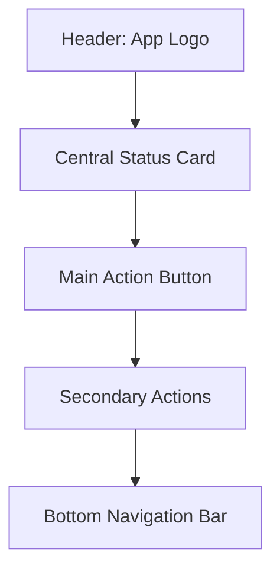
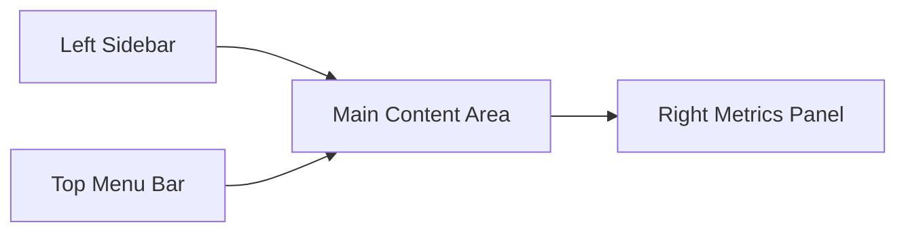

# Comprehensive UI/UX Design Strategy for Simplified Cross-Platform VPN Client

## Project Overview

This design strategy outlines the approach for developing a simplified VPN client with only three core functions: "Add Profile", "Start VPN", and "Settings". The client must work consistently across all platforms: Windows, Linux, macOS, Android, and iOS.

### Current State Analysis

The existing project provides server-side VPN infrastructure with:
- WireGuard protocol for maximum speed
- XRay for obfuscation and bypassing restrictions
- Client onboarding scripts for various platforms
- x-ui/3x-ui management panel for server administration

However, there is **no native client-side UI** for end-users. Users currently rely on third-party applications to connect to the VPN service, which creates a fragmented experience. This UI/UX design strategy addresses this gap.

## 1. Unified Design Language

### Core Philosophy: "Minimalist Excellence"
- **Simplicity First**: Every element serves a purpose, nothing more
- **Consistency Across Platforms**: Maintain recognizable identity while respecting platform norms
- **Intuitive for Non-Technical Users**: No jargon, clear guidance, visual feedback

### Visual Design System

#### Color Palette
- **Primary**: Deep Blue (#1E3A8A) - Trust, Security
- **Success**: Forest Green (#059669) - Connection established
- **Warning**: Amber (#D97706) - Connection unstable
- **Error**: Crimson (#DC2626) - Connection failed
- **Background**: Clean White (#FFFFFF) / Off-black (#111827) for dark mode
- **Neutrals**: Gray scale (50-900) for text and UI elements

#### Typography
- **Primary Font**: System font stack (San Francisco, Roboto, Segoe UI, etc.)
- **Heading Scale**: 24px, 20px, 18px, 16px
- **Body Text**: 14px minimum for readability
- **Line Height**: 1.5 for optimal readability

#### Spacing System
- **Base Unit**: 8px grid system
- **Component Padding**: 16px (2 units)
- **Section Margins**: 24px (3 units)
- **Button Heights**: 48px minimum (touch targets)

### Platform-Specific Adaptations

#### Mobile (Android & iOS)
- Follow Material Design (Android) and Human Interface Guidelines (iOS)
- Larger touch targets (48px minimum)
- Bottom tab navigation when needed
- Platform-specific back/navigation gestures

#### Desktop (Windows, macOS, Linux)
- Native window controls and title bars
- Keyboard shortcuts (Alt+F for File, Ctrl+C for copy, etc.)
- Context menus
- Window resizing and positioning

## 2. Connection Status and Performance Indicators

### Central Status Display
```
┌─────────────────────┐
│        [VPN ICON]   │
│     CONNECTED       │
│   (City, Country)   │
│                     │
│     ↓ 18.2 MB/s     │
│     ↑ 12.4 MB/s     │
│    Ping: 24ms       │
└─────────────────────┘
```

### Status States
1. **Disconnected**: Gray circle icon, "Disconnected"
2. **Connecting**: Spinner animation, "Connecting..."
3. **Connected**: Green shield/checkmark, "Connected"
4. **Error**: Red exclamation, "Connection Failed"

### Performance Metrics Display
- **Download Speed**: Downward arrow + value in Mbps
- **Upload Speed**: Upward arrow + value in Mbps
- **Ping**: Lightning bolt + value in milliseconds
- **Location**: Globe + server location (city, country)

### Visual Feedback System
- **Real-time Updates**: Metrics refresh every 2 seconds
- **Smooth Animations**: Subtle transitions between states
- **Color Coding**: Based on performance thresholds
  - Green: Excellent (under 50ms ping, over 10Mbps)
  - Yellow: Good (50-100ms ping, 5-10Mbps)
  - Red: Poor (over 100ms ping, under 5Mbps)

## 3. Minimal Settings Interface

### Settings Architecture
```
SETTINGS MENU
├── Connection Settings
│   ├── Auto-connect on startup
│   ├── DNS settings
│   └── Protocol selection
├── Split Tunneling (App Routing)
│   ├── [ ] Select apps to exclude
│   └── [ ] Select apps to include
├── Privacy
│   ├── Kill switch
│   ├── IPv6 leak protection
│   └── Ad tracker blocking
└── About
    ├── Version info
    └── Support
```

### App Routing (Split Tunneling) Interface

#### Mobile Implementation
```
┌──────────────────────────┐
│ App Routing              │
│                          │
│ [Toggle] Include Mode    │
│                          │
│ Selected Apps:           │
│ [x] Chrome    [REMOVE]   │
│ [x] Spotify   [REMOVE]   │
│ [ ] Facebook            │
│ [ ] Instagram           │
│ [ ] WhatsApp            │
│ [ ] Gmail               │
└──────────────────────────┘
```

#### Desktop Implementation
```
┌─────────────────────────────────────────┐
│ Settings > App Routing                  │
│                                         │
│ □ Include Mode  ■ Exclude Mode          │
│                                         │
│ Currently routed apps:                  │
│ [x] Chrome    [x] Spotify              │
│                                         │
│ Available apps:                         │
│ [□] Facebook  [□] Instagram            │
│ [□] WhatsApp  [□] Gmail                │
│                                         │
│ [Select Apps...] [Search] [Reset]       │
└─────────────────────────────────────────┘
```

## 4. Responsive Design for Different Screen Sizes

### Mobile Layout (iOS, Android)
- Single-column layout
- Large touch targets (minimum 48px)
- Bottom navigation for main functions
- Swipe gestures for navigation



### Tablet Layout
- Side navigation panel (collapsed on mobile)
- Main content area with status metrics
- Sidebar for quick access to profiles/settings

### Desktop Layout
- Left sidebar for navigation
- Main content area
- Right panel for advanced metrics
- Top menu bar (Windows/macOS conventions)



## 5. Visual Hierarchy for Core Functions

### Primary Action: Start/Stop VPN Button
- **Prominent Position**: Center-bottom on mobile, prominent on desktop
- **Size**: Minimum 96px diameter (mobile), 64px height (desktop)
- **Color**: Primary blue when disconnected, green when connected
- **Text**: "CONNECT" / "DISCONNECT" or "START VPN" / "STOP VPN"
- **Icon**: VPN shield that changes color/state

### Secondary Actions: Add Profile & Settings
- **Position**: Top navigation (mobile) or side panel (desktop)
- **Style**: Secondary button or icon-only
- **Accessibility**: Clear labels available on hover/focus

### Information Hierarchy
1. **Connection Status**: Most prominent (central position)
2. **Performance Metrics**: Secondary importance
3. **Server Location**: Supporting information
4. **Profile Management**: Tertiary function

## 6. Accessibility Features

### Visual Accessibility
- **High Contrast Mode**: Sufficient contrast ratios (WCAG AA minimum)
- **Text Scaling**: Support up to 200% zoom without loss of functionality
- **Focus Indicators**: Clear, visible focus rings on interactive elements
- **Screen Reader Support**: Proper ARIA labels and semantic HTML

### Motor Accessibility
- **Large Touch Targets**: Minimum 44px on mobile
- **Voice Commands**: (Future) Allow basic commands via voice
- **Keyboard Navigation**: Full functionality via keyboard alone

### Cognitive Accessibility
- **Simple Language**: Plain English, no technical jargon
- **Consistent Layout**: Predictable placement of elements
- **Progressive Disclosure**: Show advanced features only when needed

## 7. Iconography and Visual Feedback

### Core Icons
- **VPN Shield**: Primary action button, changes color based on status
- **Plus Circle**: Add Profile functionality
- **Gear**: Settings access
- **Network Tower**: Server location indicator
- **Speed Arrow**: Performance metrics
- **Globe**: International connectivity

### Connection State Visuals
- **Disconnected**: Gray circle with diagonal line
- **Connecting**: Animated spinner with "connecting" text
- **Connected**: Green checkmark in shield
- **Failed**: Red exclamation in triangle
- **Reconnecting**: Yellow warning symbol

### Animation Guidelines
- **Duration**: 200-300ms for state changes
- **Easing**: Standard easing functions (ease-in-out)
- **Purpose**: Provide feedback, not decoration
- **Reduced Motion**: Respects system preferences for motion reduction

## 8. Platform-Specific Implementation Notes

### Android
- Material Design 3 (Material You) with dynamic color theming
- Compatibility with Android 7.0+ minimum
- Adaptive icons that follow system theme
- Navigation pattern following Android conventions

### iOS
- iOS Human Interface Guidelines compliance
- Dark/Light mode support with automatic switching
- Haptic feedback for interactions
- iOS 13+ compatibility
- AppClip support for quick connection without full download

### Windows
- Fluent Design integration where appropriate
- High DPI scaling support
- Taskbar notification area integration
- Windows Hello biometric support
- Microsoft Store packaging consideration

### macOS
- Natural integration with macOS UI conventions
- Menu bar status item
- Dark Mode support
- Touch Bar integration where applicable
- Mac App Store packaging consideration

### Linux
- GTK/Qt toolkit integration depending on desktop environment
- System tray integration
- Consistent with freedesktop.org standards
- Distribution-agnostic packaging (Flatpak/AppImage/Snap)

## 9. User Flow Scenarios

### First-Time User
1. App opens → Welcome screen explaining purpose
2. "Add Profile" button prompts for VPN configuration
3. User selects import method (QR code, file, manual entry)
4. Connection test automatically performed
5. Success → Main interface with "Start VPN" button
6. Failure → Clear error message with remediation steps

### Regular User
1. App opens → Shows current connection status
2. Tap "Start VPN" → Connection initiated
3. Status updates in real-time during connection process
4. Successful connection → Status shows connected with metrics
5. Tap "Stop VPN" → Connection terminated safely
6. Settings accessible via dedicated button for preferences

### Returning User
1. Auto-start enabled → VPN connects automatically
2. Manual start required → User taps "Start VPN" button
3. Quick status check available from any screen
4. Settings updated with persistent preferences

## 10. Error Handling and User Guidance

### Network Issues
- **Slow Connection**: Inform about network conditions, suggest server switch
- **No Internet**: Clear message about underlying connection
- **Server Unreachable**: Suggest alternative servers/profiles

### Configuration Issues
- **Invalid Profile**: Clear error message with validation hints
- **Expired Credentials**: Prompt for profile update/renewal
- **Certificate Issues**: Explain security implications simply

### System Integration Issues
- **Permission Required**: Guide user through OS permission granting
- **Firewall Blocking**: Simple instructions for resolution
- **Other VPN Active**: Inform about conflicts, suggest disable procedure

## Implementation Roadmap

### Phase 1: Core Functionality
- Basic UI with three-button navigation
- Single profile support
- Core connection functionality
- Basic metrics display

### Phase 2: Multi-Platform Polish
- Platform-specific UI adaptations
- Advanced settings implementation
- Split tunneling (app routing)
- Multiple profile management

### Phase 3: Enhanced Features
- Auto-server selection
- Advanced privacy features
- Custom DNS support
- Connection scheduling

This design strategy ensures a consistent, accessible, and user-friendly VPN client experience across all supported platforms while maintaining the simplicity that makes the product approachable to non-technical users.

## Project Overview

This design strategy outlines the approach for developing a simplified VPN client with only three core functions: "Add Profile", "Start VPN", and "Settings". The client must work consistently across all platforms: Windows, Linux, macOS, Android, and iOS.

### Current State Analysis

The existing project provides server-side VPN infrastructure with:
- WireGuard protocol for maximum speed
- XRay for obfuscation and bypassing restrictions
- Client onboarding scripts for various platforms
- x-ui/3x-ui management panel for server administration

However, there is **no native client-side UI** for end-users. Users currently rely on third-party applications to connect to the VPN service, which creates a fragmented experience. This UI/UX design strategy addresses this gap.

## 1. Unified Design Language

### Core Philosophy: "Minimalist Excellence"
- **Simplicity First**: Every element serves a purpose, nothing more
- **Consistency Across Platforms**: Maintain recognizable identity while respecting platform norms
- **Intuitive for Non-Technical Users**: No jargon, clear guidance, visual feedback

### Visual Design System

#### Color Palette
- **Primary**: Deep Blue (#1E3A8A) - Trust, Security
- **Success**: Forest Green (#059669) - Connection established
- **Warning**: Amber (#D97706) - Connection unstable
- **Error**: Crimson (#DC2626) - Connection failed
- **Background**: Clean White (#FFFFFF) / Off-black (#111827) for dark mode
- **Neutrals**: Gray scale (50-900) for text and UI elements

#### Typography
- **Primary Font**: System font stack (San Francisco, Roboto, Segoe UI, etc.)
- **Heading Scale**: 24px, 20px, 18px, 16px
- **Body Text**: 14px minimum for readability
- **Line Height**: 1.5 for optimal readability

#### Spacing System
- **Base Unit**: 8px grid system
- **Component Padding**: 16px (2 units)
- **Section Margins**: 24px (3 units)
- **Button Heights**: 48px minimum (touch targets)

### Platform-Specific Adaptations

#### Mobile (Android & iOS)
- Follow Material Design (Android) and Human Interface Guidelines (iOS)
- Larger touch targets (48px minimum)
- Bottom tab navigation when needed
- Platform-specific back/navigation gestures

#### Desktop (Windows, macOS, Linux)
- Native window controls and title bars
- Keyboard shortcuts (Alt+F for File, Ctrl+C for copy, etc.)
- Context menus
- Window resizing and positioning

## 2. Connection Status and Performance Indicators

### Central Status Display
```
┌─────────────────────┐
│        [VPN ICON]   │
│     CONNECTED       │
│   (City, Country)   │
│                     │
│     ↓ 18.2 MB/s     │
│     ↑ 12.4 MB/s     │
│    Ping: 24ms       │
└─────────────────────┘
```

### Status States
1. **Disconnected**: Gray circle icon, "Disconnected"
2. **Connecting**: Spinner animation, "Connecting..."
3. **Connected**: Green shield/checkmark, "Connected"
4. **Error**: Red exclamation, "Connection Failed"

### Performance Metrics Display
- **Download Speed**: Downward arrow + value in Mbps
- **Upload Speed**: Upward arrow + value in Mbps
- **Ping**: Lightning bolt + value in milliseconds
- **Location**: Globe + server location (city, country)

### Visual Feedback System
- **Real-time Updates**: Metrics refresh every 2 seconds
- **Smooth Animations**: Subtle transitions between states
- **Color Coding**: Based on performance thresholds
  - Green: Excellent (under 50ms ping, over 10Mbps)
  - Yellow: Good (50-100ms ping, 5-10Mbps)
  - Red: Poor (over 100ms ping, under 5Mbps)

## 3. Minimal Settings Interface

### Settings Architecture
```
SETTINGS MENU
├── Connection Settings
│   ├── Auto-connect on startup
│   ├── DNS settings
│   └── Protocol selection
├── Split Tunneling (App Routing)
│   ├── [ ] Select apps to exclude
│   └── [ ] Select apps to include
├── Privacy
│   ├── Kill switch
│   ├── IPv6 leak protection
│   └── Ad tracker blocking
└── About
    ├── Version info
    └── Support
```

### App Routing (Split Tunneling) Interface

#### Mobile Implementation
```
┌──────────────────────────┐
│ App Routing              │
│                          │
│ [Toggle] Include Mode    │
│                          │
│ Selected Apps:           │
│ [x] Chrome    [REMOVE]   │
│ [x] Spotify   [REMOVE]   │
│ [ ] Facebook            │
│ [ ] Instagram           │
│ [ ] WhatsApp            │
│ [ ] Gmail               │
└──────────────────────────┘
```

#### Desktop Implementation
```
┌─────────────────────────────────────────┐
│ Settings > App Routing                  │
│                                         │
│ □ Include Mode  ■ Exclude Mode          │
│                                         │
│ Currently routed apps:                  │
│ [x] Chrome    [x] Spotify              │
│                                         │
│ Available apps:                         │
│ [□] Facebook  [□] Instagram            │
│ [□] WhatsApp  [□] Gmail                │
│                                         │
│ [Select Apps...] [Search] [Reset]       │
└─────────────────────────────────────────┘
```

## 4. Responsive Design for Different Screen Sizes

### Mobile Layout (iOS, Android)
- Single-column layout
- Large touch targets (minimum 48px)
- Bottom navigation for main functions
- Swipe gestures for navigation


### Tablet Layout
- Side navigation panel (collapsed on mobile)
- Main content area with status metrics
- Sidebar for quick access to profiles/settings

### Desktop Layout
- Left sidebar for navigation
- Main content area
- Right panel for advanced metrics
- Top menu bar (Windows/macOS conventions)


## 5. Visual Hierarchy for Core Functions

### Primary Action: Start/Stop VPN Button
- **Prominent Position**: Center-bottom on mobile, prominent on desktop
- **Size**: Minimum 96px diameter (mobile), 64px height (desktop)
- **Color**: Primary blue when disconnected, green when connected
- **Text**: "CONNECT" / "DISCONNECT" or "START VPN" / "STOP VPN"
- **Icon**: VPN shield that changes color/state

### Secondary Actions: Add Profile & Settings
- **Position**: Top navigation (mobile) or side panel (desktop)
- **Style**: Secondary button or icon-only
- **Accessibility**: Clear labels available on hover/focus

### Information Hierarchy
1. **Connection Status**: Most prominent (central position)
2. **Performance Metrics**: Secondary importance
3. **Server Location**: Supporting information
4. **Profile Management**: Tertiary function

## 6. Accessibility Features

### Visual Accessibility
- **High Contrast Mode**: Sufficient contrast ratios (WCAG AA minimum)
- **Text Scaling**: Support up to 200% zoom without loss of functionality
- **Focus Indicators**: Clear, visible focus rings on interactive elements
- **Screen Reader Support**: Proper ARIA labels and semantic HTML

### Motor Accessibility
- **Large Touch Targets**: Minimum 44px on mobile
- **Voice Commands**: (Future) Allow basic commands via voice
- **Keyboard Navigation**: Full functionality via keyboard alone

### Cognitive Accessibility
- **Simple Language**: Plain English, no technical jargon
- **Consistent Layout**: Predictable placement of elements
- **Progressive Disclosure**: Show advanced features only when needed

## 7. Iconography and Visual Feedback

### Core Icons
- **VPN Shield**: Primary action button, changes color based on status
- **Plus Circle**: Add Profile functionality
- **Gear**: Settings access
- **Network Tower**: Server location indicator
- **Speed Arrow**: Performance metrics
- **Globe**: International connectivity

### Connection State Visuals
- **Disconnected**: Gray circle with diagonal line
- **Connecting**: Animated spinner with "connecting" text
- **Connected**: Green checkmark in shield
- **Failed**: Red exclamation in triangle
- **Reconnecting**: Yellow warning symbol

### Animation Guidelines
- **Duration**: 200-300ms for state changes
- **Easing**: Standard easing functions (ease-in-out)
- **Purpose**: Provide feedback, not decoration
- **Reduced Motion**: Respects system preferences for motion reduction

## 8. Platform-Specific Implementation Notes

### Android
- Material Design 3 (Material You) with dynamic color theming
- Compatibility with Android 7.0+ minimum
- Adaptive icons that follow system theme
- Navigation pattern following Android conventions

### iOS
- iOS Human Interface Guidelines compliance
- Dark/Light mode support with automatic switching
- Haptic feedback for interactions
- iOS 13+ compatibility
- AppClip support for quick connection without full download

### Windows
- Fluent Design integration where appropriate
- High DPI scaling support
- Taskbar notification area integration
- Windows Hello biometric support
- Microsoft Store packaging consideration

### macOS
- Natural integration with macOS UI conventions
- Menu bar status item
- Dark Mode support
- Touch Bar integration where applicable
- Mac App Store packaging consideration

### Linux
- GTK/Qt toolkit integration depending on desktop environment
- System tray integration
- Consistent with freedesktop.org standards
- Distribution-agnostic packaging (Flatpak/AppImage/Snap)

## 9. User Flow Scenarios

### First-Time User
1. App opens → Welcome screen explaining purpose
2. "Add Profile" button prompts for VPN configuration
3. User selects import method (QR code, file, manual entry)
4. Connection test automatically performed
5. Success → Main interface with "Start VPN" button
6. Failure → Clear error message with remediation steps

### Regular User
1. App opens → Shows current connection status
2. Tap "Start VPN" → Connection initiated
3. Status updates in real-time during connection process
4. Successful connection → Status shows connected with metrics
5. Tap "Stop VPN" → Connection terminated safely
6. Settings accessible via dedicated button for preferences

### Returning User
1. Auto-start enabled → VPN connects automatically
2. Manual start required → User taps "Start VPN" button
3. Quick status check available from any screen
4. Settings updated with persistent preferences

## 10. Error Handling and User Guidance

### Network Issues
- **Slow Connection**: Inform about network conditions, suggest server switch
- **No Internet**: Clear message about underlying connection
- **Server Unreachable**: Suggest alternative servers/profiles

### Configuration Issues
- **Invalid Profile**: Clear error message with validation hints
- **Expired Credentials**: Prompt for profile update/renewal
- **Certificate Issues**: Explain security implications simply

### System Integration Issues
- **Permission Required**: Guide user through OS permission granting
- **Firewall Blocking**: Simple instructions for resolution
- **Other VPN Active**: Inform about conflicts, suggest disable procedure

## Implementation Roadmap

### Phase 1: Core Functionality
- Basic UI with three-button navigation
- Single profile support
- Core connection functionality
- Basic metrics display

### Phase 2: Multi-Platform Polish
- Platform-specific UI adaptations
- Advanced settings implementation
- Split tunneling (app routing)
- Multiple profile management

### Phase 3: Enhanced Features
- Auto-server selection
- Advanced privacy features
- Custom DNS support
- Connection scheduling

This design strategy ensures a consistent, accessible, and user-friendly VPN client experience across all supported platforms while maintaining the simplicity that makes the product approachable to non-technical users.
## Project Overview

This design strategy outlines the approach for developing a simplified VPN client with only three core functions: "Add Profile", "Start VPN", and "Settings". The client must work consistently across all platforms: Windows, Linux, macOS, Android, and iOS.

### Current State Analysis

The existing project provides server-side VPN infrastructure with:
- WireGuard protocol for maximum speed
- XRay for obfuscation and bypassing restrictions
- Client onboarding scripts for various platforms
- x-ui/3x-ui management panel for server administration

However, there is **no native client-side UI** for end-users. Users currently rely on third-party applications to connect to the VPN service, which creates a fragmented experience. This UI/UX design strategy addresses this gap.

## 1. Unified Design Language

### Core Philosophy: "Minimalist Excellence"
- **Simplicity First**: Every element serves a purpose, nothing more
- **Consistency Across Platforms**: Maintain recognizable identity while respecting platform norms
- **Intuitive for Non-Technical Users**: No jargon, clear guidance, visual feedback

### Visual Design System

#### Color Palette
- **Primary**: Deep Blue (#1E3A8A) - Trust, Security
- **Success**: Forest Green (#059669) - Connection established
- **Warning**: Amber (#D97706) - Connection unstable
- **Error**: Crimson (#DC2626) - Connection failed
- **Background**: Clean White (#FFFFFF) / Off-black (#111827) for dark mode
- **Neutrals**: Gray scale (50-900) for text and UI elements

#### Typography
- **Primary Font**: System font stack (San Francisco, Roboto, Segoe UI, etc.)
- **Heading Scale**: 24px, 20px, 18px, 16px
- **Body Text**: 14px minimum for readability
- **Line Height**: 1.5 for optimal readability

#### Spacing System
- **Base Unit**: 8px grid system
- **Component Padding**: 16px (2 units)
- **Section Margins**: 24px (3 units)
- **Button Heights**: 48px minimum (touch targets)

### Platform-Specific Adaptations

#### Mobile (Android & iOS)
- Follow Material Design (Android) and Human Interface Guidelines (iOS)
- Larger touch targets (48px minimum)
- Bottom tab navigation when needed
- Platform-specific back/navigation gestures

#### Desktop (Windows, macOS, Linux)
- Native window controls and title bars
- Keyboard shortcuts (Alt+F for File, Ctrl+C for copy, etc.)
- Context menus
- Window resizing and positioning

## 2. Connection Status and Performance Indicators

### Central Status Display
```
┌─────────────────────┐
│        [VPN ICON]   │
│     CONNECTED       │
│   (City, Country)   │
│                     │
│     ↓ 18.2 MB/s     │
│     ↑ 12.4 MB/s     │
│    Ping: 24ms       │
└─────────────────────┘
```

### Status States
1. **Disconnected**: Gray circle icon, "Disconnected"
2. **Connecting**: Spinner animation, "Connecting..."
3. **Connected**: Green shield/checkmark, "Connected"
4. **Error**: Red exclamation, "Connection Failed"

### Performance Metrics Display
- **Download Speed**: Downward arrow + value in Mbps
- **Upload Speed**: Upward arrow + value in Mbps
- **Ping**: Lightning bolt + value in milliseconds
- **Location**: Globe + server location (city, country)

### Visual Feedback System
- **Real-time Updates**: Metrics refresh every 2 seconds
- **Smooth Animations**: Subtle transitions between states
- **Color Coding**: Based on performance thresholds
  - Green: Excellent (under 50ms ping, over 10Mbps)
  - Yellow: Good (50-100ms ping, 5-10Mbps)
  - Red: Poor (over 100ms ping, under 5Mbps)

## 3. Minimal Settings Interface

### Settings Architecture
```
SETTINGS MENU
├── Connection Settings
│   ├── Auto-connect on startup
│   ├── DNS settings
│   └── Protocol selection
├── Split Tunneling (App Routing)
│   ├── [ ] Select apps to exclude
│   └── [ ] Select apps to include
├── Privacy
│   ├── Kill switch
│   ├── IPv6 leak protection
│   └── Ad tracker blocking
└── About
    ├── Version info
    └── Support
```

### App Routing (Split Tunneling) Interface

#### Mobile Implementation
```
┌──────────────────────────┐
│ App Routing              │
│                          │
│ [Toggle] Include Mode    │
│                          │
│ Selected Apps:           │
│ [x] Chrome    [REMOVE]   │
│ [x] Spotify   [REMOVE]   │
│ [ ] Facebook            │
│ [ ] Instagram           │
│ [ ] WhatsApp            │
│ [ ] Gmail               │
└──────────────────────────┘
```

#### Desktop Implementation
```
┌─────────────────────────────────────────┐
│ Settings > App Routing                  │
│                                         │
│ □ Include Mode  ■ Exclude Mode          │
│                                         │
│ Currently routed apps:                  │
│ [x] Chrome    [x] Spotify              │
│                                         │
│ Available apps:                         │
│ [□] Facebook  [□] Instagram            │
│ [□] WhatsApp  [□] Gmail                │
│                                         │
│ [Select Apps...] [Search] [Reset]       │
└─────────────────────────────────────────┘
```

## 4. Responsive Design for Different Screen Sizes

### Mobile Layout (iOS, Android)
- Single-column layout
- Large touch targets (minimum 48px)
- Bottom navigation for main functions
- Swipe gestures for navigation


### Tablet Layout
- Side navigation panel (collapsed on mobile)
- Main content area with status metrics
- Sidebar for quick access to profiles/settings

### Desktop Layout
- Left sidebar for navigation
- Main content area
- Right panel for advanced metrics
- Top menu bar (Windows/macOS conventions)


## 5. Visual Hierarchy for Core Functions

### Primary Action: Start/Stop VPN Button
- **Prominent Position**: Center-bottom on mobile, prominent on desktop
- **Size**: Minimum 96px diameter (mobile), 64px height (desktop)
- **Color**: Primary blue when disconnected, green when connected
- **Text**: "CONNECT" / "DISCONNECT" or "START VPN" / "STOP VPN"
- **Icon**: VPN shield that changes color/state

### Secondary Actions: Add Profile & Settings
- **Position**: Top navigation (mobile) or side panel (desktop)
- **Style**: Secondary button or icon-only
- **Accessibility**: Clear labels available on hover/focus

### Information Hierarchy
1. **Connection Status**: Most prominent (central position)
2. **Performance Metrics**: Secondary importance
3. **Server Location**: Supporting information
4. **Profile Management**: Tertiary function

## 6. Accessibility Features

### Visual Accessibility
- **High Contrast Mode**: Sufficient contrast ratios (WCAG AA minimum)
- **Text Scaling**: Support up to 200% zoom without loss of functionality
- **Focus Indicators**: Clear, visible focus rings on interactive elements
- **Screen Reader Support**: Proper ARIA labels and semantic HTML

### Motor Accessibility
- **Large Touch Targets**: Minimum 44px on mobile
- **Voice Commands**: (Future) Allow basic commands via voice
- **Keyboard Navigation**: Full functionality via keyboard alone

### Cognitive Accessibility
- **Simple Language**: Plain English, no technical jargon
- **Consistent Layout**: Predictable placement of elements
- **Progressive Disclosure**: Show advanced features only when needed

## 7. Iconography and Visual Feedback

### Core Icons
- **VPN Shield**: Primary action button, changes color based on status
- **Plus Circle**: Add Profile functionality
- **Gear**: Settings access
- **Network Tower**: Server location indicator
- **Speed Arrow**: Performance metrics
- **Globe**: International connectivity

### Connection State Visuals
- **Disconnected**: Gray circle with diagonal line
- **Connecting**: Animated spinner with "connecting" text
- **Connected**: Green checkmark in shield
- **Failed**: Red exclamation in triangle
- **Reconnecting**: Yellow warning symbol

### Animation Guidelines
- **Duration**: 200-300ms for state changes
- **Easing**: Standard easing functions (ease-in-out)
- **Purpose**: Provide feedback, not decoration
- **Reduced Motion**: Respects system preferences for motion reduction

## 8. Platform-Specific Implementation Notes

### Android
- Material Design 3 (Material You) with dynamic color theming
- Compatibility with Android 7.0+ minimum
- Adaptive icons that follow system theme
- Navigation pattern following Android conventions

### iOS
- iOS Human Interface Guidelines compliance
- Dark/Light mode support with automatic switching
- Haptic feedback for interactions
- iOS 13+ compatibility
- AppClip support for quick connection without full download

### Windows
- Fluent Design integration where appropriate
- High DPI scaling support
- Taskbar notification area integration
- Windows Hello biometric support
- Microsoft Store packaging consideration

### macOS
- Natural integration with macOS UI conventions
- Menu bar status item
- Dark Mode support
- Touch Bar integration where applicable
- Mac App Store packaging consideration

### Linux
- GTK/Qt toolkit integration depending on desktop environment
- System tray integration
- Consistent with freedesktop.org standards
- Distribution-agnostic packaging (Flatpak/AppImage/Snap)

## 9. User Flow Scenarios

### First-Time User
1. App opens → Welcome screen explaining purpose
2. "Add Profile" button prompts for VPN configuration
3. User selects import method (QR code, file, manual entry)
4. Connection test automatically performed
5. Success → Main interface with "Start VPN" button
6. Failure → Clear error message with remediation steps

### Regular User
1. App opens → Shows current connection status
2. Tap "Start VPN" → Connection initiated
3. Status updates in real-time during connection process
4. Successful connection → Status shows connected with metrics
5. Tap "Stop VPN" → Connection terminated safely
6. Settings accessible via dedicated button for preferences

### Returning User
1. Auto-start enabled → VPN connects automatically
2. Manual start required → User taps "Start VPN" button
3. Quick status check available from any screen
4. Settings updated with persistent preferences

## 10. Error Handling and User Guidance

### Network Issues
- **Slow Connection**: Inform about network conditions, suggest server switch
- **No Internet**: Clear message about underlying connection
- **Server Unreachable**: Suggest alternative servers/profiles

### Configuration Issues
- **Invalid Profile**: Clear error message with validation hints
- **Expired Credentials**: Prompt for profile update/renewal
- **Certificate Issues**: Explain security implications simply

### System Integration Issues
- **Permission Required**: Guide user through OS permission granting
- **Firewall Blocking**: Simple instructions for resolution
- **Other VPN Active**: Inform about conflicts, suggest disable procedure

## Implementation Roadmap

### Phase 1: Core Functionality
- Basic UI with three-button navigation
- Single profile support
- Core connection functionality
- Basic metrics display

### Phase 2: Multi-Platform Polish
- Platform-specific UI adaptations
- Advanced settings implementation
- Split tunneling (app routing)
- Multiple profile management

### Phase 3: Enhanced Features
- Auto-server selection
- Advanced privacy features
- Custom DNS support
- Connection scheduling

This design strategy ensures a consistent, accessible, and user-friendly VPN client experience across all supported platforms while maintaining the simplicity that makes the product approachable to non-technical users.
